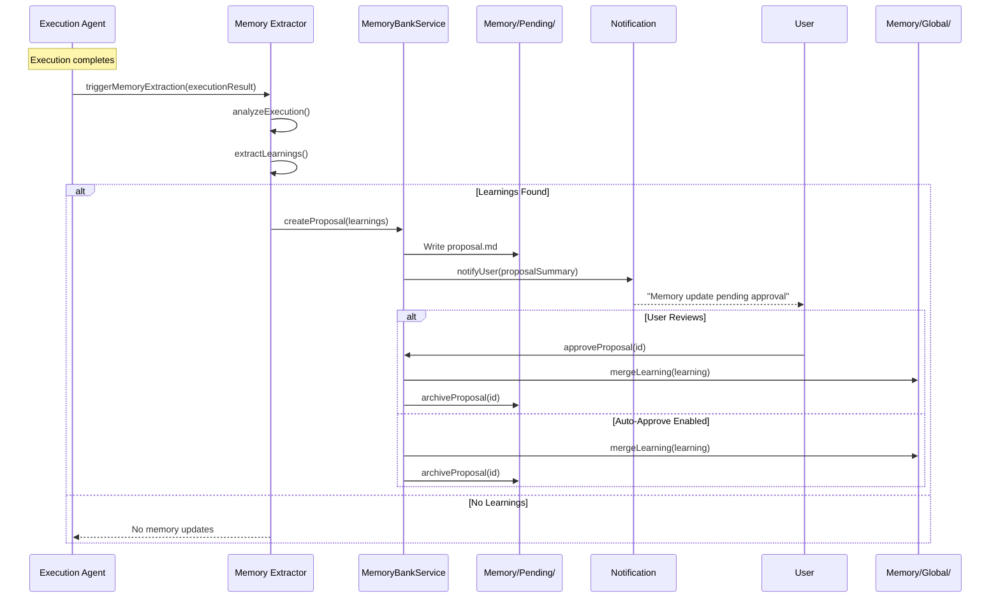

# Phase 12.5+: Memory Banks v2 Enhanced Architecture

**Document Version:** 1.3.0
**Date:** 2026-01-04
**Author:** Architecture Agent
**Status:** IN PROGRESS (Phase 12.5 ✅, Phase 12.8 ✅, Phase 12.9 ✅, Phase 12.10 ✅, Phase 12.11 ✅, Phase 12.12 ✅, Phase 12.13 ✅, Phase 12.14 ✅)
**Parent Phase:** [Phase 12: Obsidian Retirement](phase-12-obsidian-retirement.md)
**Target Release:** v1.1

---

## Table of Contents

1. [Executive Summary](#1-executive-summary)
2. [Gap Analysis: Current vs. Desired State](#2-gap-analysis)
3. [Reference Architecture Survey](#3-reference-architecture-survey)
4. [Enhanced Architecture Design](#4-enhanced-architecture-design)
5. [Data Format Decisions](#5-data-format-decisions)
6. [Embedding Reuse Strategy](#6-embedding-reuse-strategy)
7. [Implementation Phases](#7-implementation-phases)
8. [Rollback Plan](#8-rollback-plan)
9. [Success Metrics](#9-success-metrics)
10. [References](#10-references)

---

## 1. Executive Summary

This document extends the Memory Banks architecture defined in Phase 12 with advanced capabilities inspired by production memory systems (mem0, MemGPT, Zep, LangMem). The enhancements focus on:

- **Global Memory Scope** - Cross-project learnings in `Memory/Global/`
- **Agent-Driven Memory Updates** - Automated memory extraction with user notification
- **Simple RAG Implementation** - Keyword/tag-based search without external dependencies
- **Comprehensive CLI Surface** - Unified `exoctl memory` command tree
- **Integration Points** - Seamless integration with `agents/manifest` and Activity Journal

### Key Design Decisions

| Decision | Rationale |
|----------|-----------|
| **Markdown for human-readable content** | Patterns, decisions, learnings stored as `.md` for developer review |
| **JSON for structured indices** | Fast programmatic access for search and filtering |
| **No external vector DB** | Reuse `agents/embeddings/` pattern with mock vectors |
| **CLI-first interface** | Both users and agents interact via `exoctl memory` |
| **Pending → Approved workflow** | User notification before memory updates are finalized |

### Dependencies

- Phase 12.1-12.4: Memory Banks Architecture (COMPLETED ✅)
- `src/services/memory_bank.ts`: Core CRUD operations (COMPLETED ✅)
- `agents/embeddings/`: Precomputed embedding infrastructure (AVAILABLE ✅)

---

## 2. Gap Analysis

### 2.1 Current State (Phase 12.1-12.4)

| Capability | Status | Implementation |
|------------|--------|----------------|
| Project Memory | ✅ | `Memory/Projects/{portal}/` |
| Execution History | ✅ | `Memory/Execution/{trace-id}/` |
| Activity Journal Integration | ✅ | SQLite logging via `DatabaseService` |
| Search (basic) | ✅ | `searchMemory()` in MemoryBankService |
| CLI Commands | ❌ | Not implemented |
| Global Memory | ❌ | Not implemented |
| Agent Memory Updates | ❌ | Not implemented |
| Semantic/RAG Search | ❌ | Not implemented |
| User Notification | ❌ | Not implemented |

### 2.2 Desired State (Memory Banks v2)

| Capability | Priority | Phase |
|------------|----------|-------|
| Core CLI Commands | HIGH | 12.5 |
| Global Memory (`Memory/Global/`) | HIGH | 12.8 |
| Memory Promote/Demote | MEDIUM | 12.8 |
| Agent Memory Extraction | HIGH | 12.9 |
| Pending/Approval Workflow | MEDIUM | 12.9 |
| User Notification | MEDIUM | 12.9 |
| Tag-Based Search | HIGH | 12.10 |
| Simple RAG (no external deps) | LOW | 12.10 |

### 2.3 Feature Gap Summary

```
┌─────────────────────────────────────────────────────────────────┐
│                    Memory Banks Feature Gap                     │
├─────────────────────────────────────────────────────────────────┤
│  CURRENT (v1)          │  GAP              │  TARGET (v2)       │
├─────────────────────────────────────────────────────────────────┤
│  Project-scoped only   │  → Global scope   │  Global + Project  │
│  Manual updates        │  → Automation     │  Agent-driven      │
│  No CLI                │  → Full CLI       │  exoctl memory     │
│  Basic text search     │  → Tag + keyword  │  Simple RAG        │
│  Silent operations     │  → Notification   │  User approval     │
│  JSON-heavy            │  → Markdown-first │  Human-readable    │
└─────────────────────────────────────────────────────────────────┘
```

---

## 3. Reference Architecture Survey

### 3.1 Industry Memory Systems

| System | Key Innovation | Relevance to ExoFrame |
|--------|----------------|----------------------|
| **mem0** | Adaptive memory layers (user/agent/session) | Multi-scope memory hierarchy |
| **MemGPT** | Self-editing memory with archival system | Agent-managed memory updates |
| **Zep** | Temporal awareness + entity extraction | Pattern extraction from executions |
| **LangMem** | Semantic memory graphs | Tag-based relationship mapping |

### 3.2 Patterns to Adopt

1. **Memory Hierarchy (mem0)**
   - Global → Project → Execution → Session
   - Promote/demote between levels

2. **Memory Curation (MemGPT)**
   - Agent proposes memory updates
   - User approves before finalization
   - Automatic archival of stale entries

3. **Pattern Extraction (Zep)**
   - Extract learnings from execution results
   - Link related patterns across projects

4. **Simple Retrieval (LangMem)**
   - Tag-based categorization
   - Keyword search without vector DB
   - Optional embedding for fuzzy match

### 3.3 Patterns to Avoid

| Anti-Pattern | Reason | Alternative |
|--------------|--------|-------------|
| External vector database | Adds complexity, ExoFrame is self-contained | Reuse `agents/embeddings/` mock vectors |
| Graph database for relations | Over-engineering for current scope | JSON indices with tag cross-references |
| Real-time memory sync | Performance overhead | Batch updates on execution complete |
| Auto-approve all memory | Quality control issues | User notification + approval workflow |

---

## 4. Enhanced Architecture Design

### 4.1 Enhanced Directory Structure

```
Memory/
├── Global/                    # NEW: Cross-project learnings
│   ├── learnings.md           # Promoted learnings (human-readable)
│   ├── learnings.json         # Structured index for search
│   ├── patterns.md            # Global code patterns
│   └── anti-patterns.md       # What to avoid
│
├── Projects/                  # Existing: Project-specific memory
│   └── {portal-name}/
│       ├── overview.md
│       ├── patterns.md
│       ├── decisions.md
│       ├── references.md
│       └── context.json       # Structured data for search
│
├── Execution/                 # Existing: Execution history
│   └── {trace-id}/
│       ├── summary.md
│       ├── context.json
│       ├── changes.diff
│       └── learnings.md       # NEW: Extracted learnings
│
├── Pending/                   # NEW: Awaiting user approval
│   └── {timestamp}-{type}.md  # Proposed memory updates
│
├── Tasks/                     # Existing: Task tracking
│   ├── active/
│   ├── completed/
│   └── failed/
│
└── Index/                     # Enhanced: Search indices
    ├── files.json
    ├── patterns.json
    ├── tags.json
    ├── learnings.json         # NEW: Learning index
    └── embeddings/            # NEW: Optional mock embeddings
        ├── manifest.json
        └── {hash}.json
```

### 4.2 Enhanced Schemas

#### 4.2.1 Learning Schema (NEW)

```typescript
// src/schemas/memory_bank.ts

export const LearningSchema = z.object({
  id: z.string().uuid(),
  created_at: z.string().datetime(),
  source: z.enum(["execution", "user", "agent"]),
  source_id: z.string().optional().describe("trace_id or user session"),

  scope: z.enum(["global", "project"]),
  project: z.string().optional().describe("Portal name if project-scoped"),

  title: z.string().max(100),
  description: z.string().max(500),

  category: z.enum([
    "pattern",        // Code pattern learned
    "anti-pattern",   // What to avoid
    "decision",       // Architectural choice
    "insight",        // General observation
    "troubleshooting" // Problem + solution
  ]),

  tags: z.array(z.string()).max(10),

  confidence: z.enum(["low", "medium", "high"]),

  references: z.array(z.object({
    type: z.enum(["file", "execution", "url", "doc"]),
    path: z.string(),
  })).optional(),

  status: z.enum(["pending", "approved", "rejected", "archived"]),
  approved_at: z.string().datetime().optional(),
  archived_at: z.string().datetime().optional(),
});

export type Learning = z.infer<typeof LearningSchema>;
```

#### 4.2.2 Memory Update Proposal Schema (NEW)

```typescript
export const MemoryUpdateProposalSchema = z.object({
  id: z.string().uuid(),
  created_at: z.string().datetime(),

  operation: z.enum(["add", "update", "promote", "demote", "archive"]),
  target_scope: z.enum(["global", "project"]),
  target_project: z.string().optional(),

  learning: LearningSchema.omit({ status: true, approved_at: true }),

  reason: z.string().describe("Why this update is proposed"),
  agent: z.string().describe("Agent that proposed the update"),
  execution_id: z.string().optional(),

  status: z.enum(["pending", "approved", "rejected"]),
  reviewed_at: z.string().datetime().optional(),
  reviewed_by: z.enum(["user", "auto"]).optional(),
});

export type MemoryUpdateProposal = z.infer<typeof MemoryUpdateProposalSchema>;
```

#### 4.2.3 Global Memory Schema (NEW)

```typescript
export const GlobalMemorySchema = z.object({
  version: z.string(),
  updated_at: z.string().datetime(),

  learnings: z.array(LearningSchema),

  patterns: z.array(z.object({
    name: z.string(),
    description: z.string(),
    applies_to: z.array(z.string()).describe("Project patterns or 'all'"),
    examples: z.array(z.string()),
    tags: z.array(z.string()),
  })),

  anti_patterns: z.array(z.object({
    name: z.string(),
    description: z.string(),
    reason: z.string(),
    alternative: z.string(),
    tags: z.array(z.string()),
  })),

  statistics: z.object({
    total_learnings: z.number(),
    by_category: z.record(z.number()),
    by_project: z.record(z.number()),
    last_activity: z.string().datetime(),
  }),
});

export type GlobalMemory = z.infer<typeof GlobalMemorySchema>;
```

### 4.3 CLI Command Tree

```
exoctl memory
├── list                       # List all memory banks
│   └── --format json|table|md
│
├── search <query>             # Search across all memory
│   ├── --scope global|project|all
│   ├── --tags <tags>
│   ├── --category <category>
│   └── --format json|table|md
│
├── project                    # Project memory operations
│   ├── list                   # List all project memories
│   ├── show <portal>          # Show project memory details
│   ├── add-pattern <portal>   # Add pattern to project
│   ├── add-decision <portal>  # Add decision to project
│   └── export <portal>        # Export project memory
│
├── execution                  # Execution history operations
│   ├── list                   # List recent executions
│   │   ├── --portal <portal>
│   │   └── --limit <n>
│   ├── show <trace-id>        # Show execution details
│   └── extract-learnings <trace-id>  # Extract learnings
│
├── global                     # Global memory operations
│   ├── show                   # Show global memory
│   ├── add-learning           # Add global learning
│   ├── list-learnings         # List all learnings
│   └── stats                  # Show memory statistics
│
├── pending                    # Pending updates
│   ├── list                   # List pending updates
│   ├── show <id>              # Show pending update details
│   ├── approve <id>           # Approve pending update
│   ├── reject <id>            # Reject pending update
│   └── approve-all            # Approve all pending
│
├── promote <learning-id>      # Promote project→global
│   └── --from <portal>
│
├── demote <learning-id>       # Demote global→project
│   └── --to <portal>
│
└── rebuild-index              # Rebuild search indices
```

### 4.4 Agent Memory Update Workflow



### 4.5 Notification System

Memory updates notify users through:

1. **TUI Dashboard** - Badge on Memory tab
2. **CLI Output** - Message after command execution
3. **Activity Journal** - Logged for audit trail

```typescript
// src/services/notification.ts

export interface MemoryNotification {
  type: "memory_update_pending" | "memory_approved" | "memory_rejected";
  message: string;
  proposal_id: string;
  created_at: string;
}

export class NotificationService {
  async notifyMemoryUpdate(proposal: MemoryUpdateProposal): Promise<void> {
    // Log to Activity Journal
    await this.db.logEvent({
      event_type: "memory.update.pending",
      data: { proposal_id: proposal.id, reason: proposal.reason },
    });

    // Write to notification file for TUI
    const notifPath = "System/Notifications/memory.json";
    // ... append notification
  }
}
```

---

## 5. Data Format Decisions

### 5.1 Markdown vs JSON Analysis

| Content Type | Format | Rationale |
|--------------|--------|-----------|
| Project Overview | `.md` | Human-authored, needs readability |
| Patterns & Decisions | `.md` | Reviewed by developers |
| Learnings | `.md` | Narrative context important |
| Execution Summary | `.md` | Human-readable reports |
| Context Data | `.json` | Programmatic access for agents |
| Search Indices | `.json` | Fast lookup, no human editing |
| Pending Proposals | `.md` | User needs to review content |
| Statistics | `.json` | Numerical data, charting |

### 5.2 Hybrid Approach

Each memory bank component uses **paired files**:

```
Memory/Projects/my-app/
├── patterns.md          # Human-readable content
└── patterns.json        # Structured data for search
```

**Markdown Content:**
```markdown
# Code Patterns: my-app

## Error Handling Pattern

**Added:** 2026-01-04
**Tags:** error-handling, typescript

All async functions should use try-catch with typed errors:

```typescript
try {
  await operation();
} catch (error) {
  if (error instanceof AppError) {
    // handle known error
  }
  throw error;
}
```

**Files:** `src/services/*.ts`
```

**JSON Index:**
```json
{
  "portal": "my-app",
  "patterns": [
    {
      "id": "pat-001",
      "name": "Error Handling Pattern",
      "added": "2026-01-04",
      "tags": ["error-handling", "typescript"],
      "files": ["src/services/*.ts"]
    }
  ]
}
```

### 5.3 Index Synchronization

The `MemoryBankService` maintains consistency:

```typescript
async addPattern(portal: string, pattern: Pattern): Promise<void> {
  // 1. Append to patterns.md (human-readable)
  await this.appendToMarkdown(`Memory/Projects/${portal}/patterns.md`, pattern);

  // 2. Update patterns.json (machine-readable)
  await this.updateJsonIndex(`Memory/Projects/${portal}/patterns.json`, pattern);

  // 3. Update global index
  await this.updateGlobalIndex("Index/patterns.json", portal, pattern);

  // 4. Log to Activity Journal
  await this.db.logEvent({ event_type: "memory.pattern.added", ... });
}
```

---

## 6. Embedding Reuse Strategy

### 6.1 Existing Infrastructure

The `agents/embeddings/` directory contains:

- `manifest.json` - Index of all embedded documents
- `{doc}.json` - Precomputed embeddings per document
- `scripts/build_agents_embeddings.ts` - Build script with mock/OpenAI modes

**Mock Vector Generation:**
```typescript
// From scripts/build_agents_embeddings.ts
async function mockVector(text: string, dim = 64): Promise<number[]> {
  const digest = await sha256Bytes(text);
  const vec: number[] = [];
  for (let i = 0; i < dim; i++) {
    vec.push(digest[i % digest.length] / 255);
  }
  return vec;
}
```

### 6.2 Memory Bank Embedding Strategy

Reuse the same pattern for Memory Banks:

```typescript
// src/services/memory_embedding.ts

import { mockVector, chunkText } from "../../scripts/build_agents_embeddings.ts";

export class MemoryEmbeddingService {
  private readonly EMBED_DIR = "Memory/Index/embeddings";

  async embedLearning(learning: Learning): Promise<void> {
    const text = `${learning.title}\n${learning.description}`;
    const chunks = chunkText(text, 400);

    const vecs = await Promise.all(
      chunks.map(async (chunk) => ({
        text: chunk,
        vector: await mockVector(chunk, 64),
      }))
    );

    const outPath = `${this.EMBED_DIR}/${learning.id}.json`;
    await Deno.writeTextFile(outPath, JSON.stringify({
      id: learning.id,
      scope: learning.scope,
      category: learning.category,
      vecs,
    }, null, 2));

    await this.updateManifest(learning.id, outPath);
  }

  async searchByEmbedding(query: string, limit = 10): Promise<Learning[]> {
    const queryVec = await mockVector(query, 64);

    // Load all embeddings and compute cosine similarity
    const manifest = await this.loadManifest();
    const results: { id: string; score: number }[] = [];

    for (const entry of manifest.index) {
      const embedding = await this.loadEmbedding(entry.path);
      for (const vec of embedding.vecs) {
        const score = this.cosineSimilarity(queryVec, vec.vector);
        results.push({ id: embedding.id, score });
      }
    }

    // Sort by score and return top results
    results.sort((a, b) => b.score - a.score);
    const topIds = [...new Set(results.slice(0, limit).map(r => r.id))];

    return this.loadLearningsByIds(topIds);
  }

  private cosineSimilarity(a: number[], b: number[]): number {
    let dot = 0, magA = 0, magB = 0;
    for (let i = 0; i < a.length; i++) {
      dot += a[i] * b[i];
      magA += a[i] * a[i];
      magB += b[i] * b[i];
    }
    return dot / (Math.sqrt(magA) * Math.sqrt(magB));
  }
}
```

### 6.3 Search Priority

The search implementation uses a **tiered approach**:

1. **Exact tag match** - Fastest, highest relevance
2. **Keyword search** - Text contains query terms
3. **Embedding similarity** - Fuzzy match (optional, when enabled)

```typescript
async searchMemory(query: string, options: SearchOptions): Promise<SearchResult[]> {
  const results: SearchResult[] = [];

  // Tier 1: Tag match
  if (options.tags) {
    results.push(...await this.searchByTags(options.tags));
  }

  // Tier 2: Keyword search
  const keywordResults = await this.searchByKeyword(query);
  results.push(...keywordResults);

  // Tier 3: Embedding search (optional)
  if (options.useEmbeddings && keywordResults.length < options.limit) {
    const embeddingResults = await this.embeddingService.searchByEmbedding(
      query,
      options.limit - keywordResults.length
    );
    results.push(...embeddingResults);
  }

  return this.deduplicateAndRank(results, options.limit);
}
```

---

## 7. Implementation Phases

### Phase 12.5: Core CLI Commands (2 days) ✅ COMPLETED

**Goal:** Implement foundational CLI commands for Memory Banks interaction.

**Tasks:**
- [x] Create `src/cli/memory_commands.ts`
- [x] Implement `exoctl memory list`
- [x] Implement `exoctl memory search <query>`
- [x] Implement `exoctl memory project list|show`
- [x] Implement `exoctl memory execution list|show`
- [x] Add `--format json|table|md` option
- [x] Write CLI command tests
- [x] Integrate into `src/cli/exoctl.ts`

**Deliverables:**
- [x] `src/cli/memory_commands.ts` (~600 LOC)
- [x] `tests/cli/memory_commands_test.ts` (~350 LOC)
- [x] Updated `src/cli/exoctl.ts` with memory command tree

**Success Criteria:**
- [x] `exoctl memory list` returns list of all memory banks
- [x] `exoctl memory search "pattern"` returns matching entries
- [x] `exoctl memory project show my-app` displays project memory
- [x] `exoctl memory execution list --limit 10` shows recent executions
- [x] All commands support `--format json` for scripting
- [x] 100% of new CLI commands have unit tests

**Tests (22 tests implemented, all passing):**
- `memory_commands_test.ts`:
  - `memory list returns all banks` ✅
  - `memory list with projects` ✅
  - `memory list --format json outputs valid JSON` ✅
  - `memory list --format md outputs markdown` ✅
  - `memory search finds patterns` ✅
  - `memory search no results message` ✅
  - `memory search --portal filters correctly` ✅
  - `memory search --format json` ✅
  - `memory project list shows all projects` ✅
  - `memory project list empty message` ✅
  - `memory project show displays details` ✅
  - `memory project show non-existent returns error` ✅
  - `memory project show --format json` ✅
  - `memory execution list returns history` ✅
  - `memory execution list empty message` ✅
  - `memory execution list --portal filters` ✅
  - `memory execution list --limit works` ✅
  - `memory execution show displays details` ✅
  - `memory execution show non-existent returns error` ✅
  - `memory execution show --format json` ✅
  - `memory execution show --format md` ✅
  - `rebuild-index completes successfully` ✅

---

### Phase 12.8: Global Memory (2 days) ✅ COMPLETED

**Goal:** Implement cross-project memory storage and promote/demote workflow.

**Tasks:**
- [x] Create `Memory/Global/` directory structure
- [x] Implement `GlobalMemorySchema` in `src/schemas/memory_bank.ts`
- [x] Add `LearningSchema` to schemas
- [x] Implement `getGlobalMemory()` in MemoryBankService
- [x] Implement `addGlobalLearning()` in MemoryBankService
- [x] Implement `promoteLearning()` (project → global)
- [x] Implement `demoteLearning()` (global → project)
- [x] Implement CLI commands: `exoctl memory global show|list-learnings|stats`
- [x] Implement CLI commands: `exoctl memory promote|demote`
- [x] Write unit tests for all new functionality

**Deliverables:**
- [x] Updated `src/schemas/memory_bank.ts` (+100 LOC: Learning, GlobalMemory schemas)
- [x] Updated `src/services/memory_bank.ts` (+320 LOC: global memory operations)
- [x] Updated `src/cli/memory_commands.ts` (+280 LOC: global CLI commands)

**Success Criteria:**
- [x] `Memory/Global/learnings.md` contains promoted learnings
- [x] `exoctl memory global show` displays global memory
- [x] `exoctl memory promote <id> --from my-app` moves learning to global
- [x] `exoctl memory demote <id> --to my-app` moves learning to project
- [x] All promote/demote operations logged to Activity Journal
- [x] 100% of new methods have unit tests

**Tests (35 tests implemented, all passing):**
- `memory_bank_global_test.ts` (21 tests):
  - `LearningSchema validates minimal learning` ✅
  - `LearningSchema validates global learning without project` ✅
  - `LearningSchema validates pending status with references` ✅
  - `LearningSchema rejects invalid category` ✅
  - `LearningSchema rejects invalid status` ✅
  - `GlobalMemorySchema validates empty global memory` ✅
  - `GlobalMemorySchema validates populated global memory` ✅
  - `getGlobalMemory returns null for new installation` ✅
  - `initGlobalMemory creates Global directory structure` ✅
  - `getGlobalMemory returns initialized memory` ✅
  - `addGlobalLearning creates learning entry` ✅
  - `addGlobalLearning updates markdown file` ✅
  - `addGlobalLearning logs to Activity Journal` ✅
  - `promoteLearning moves from project to global` ✅
  - `promoteLearning logs to Activity Journal` ✅
  - `promoteLearning from non-existent project throws` ✅
  - `demoteLearning moves from global to project` ✅
  - `demoteLearning removes from global index` ✅
  - `demoteLearning non-existent learning throws` ✅
  - `demoteLearning to non-existent project throws` ✅
  - `getGlobalStats returns accurate statistics` ✅
- `memory_commands_global_test.ts` (14 tests):
  - `globalShow returns empty for uninitialized` ✅
  - `globalShow displays initialized memory` ✅
  - `globalShow --format json outputs valid JSON` ✅
  - `globalShow --format md outputs markdown` ✅
  - `globalListLearnings returns empty message` ✅
  - `globalListLearnings displays learnings` ✅
  - `globalListLearnings --format json outputs valid JSON` ✅
  - `globalStats displays statistics` ✅
  - `globalStats --format json outputs valid JSON` ✅
  - `promote moves learning to global` ✅
  - `promote non-existent project returns error` ✅
  - `demote moves learning to project` ✅
  - `demote non-existent learning returns error` ✅
  - `demote to non-existent project returns error` ✅

---

### Phase 12.9: Agent Memory Updates (3 days) ✅ COMPLETED

**Goal:** Enable agents to propose memory updates with user notification.

**Tasks:**
- [x] Implement `MemoryUpdateProposalSchema`
- [x] Create `src/services/memory_extractor.ts`
- [x] Implement `analyzeExecution()` for learning extraction
- [x] Implement `createProposal()` to write to `Memory/Pending/`
- [x] Implement `NotificationService` for user alerts
- [x] Implement CLI: `exoctl memory pending list|show|approve|reject`
- [ ] Integrate memory extraction into `AgentRunner` post-execution (deferred to Phase 12.10)
- [ ] Add configuration option for auto-approve (deferred to Phase 12.10)
- [x] Write unit and integration tests

**Deliverables:**
- `src/services/memory_extractor.ts` (~360 LOC) ✅
- `src/services/notification.ts` (~195 LOC) ✅
- Updated `src/cli/memory_commands.ts` (+260 LOC) ✅
- Updated `src/cli/exoctl.ts` (+55 LOC) ✅
- `src/schemas/memory_bank.ts` (+35 LOC for ProposalLearningSchema, MemoryUpdateProposalSchema) ✅

**Success Criteria:**
- [x] After execution, learnings extracted and written to `Memory/Pending/`
- [x] User notified via CLI output: "1 memory update pending approval"
- [x] `exoctl memory pending list` shows pending proposals
- [x] `exoctl memory pending approve <id>` merges learning to target scope
- [x] `exoctl memory pending reject <id>` archives proposal
- [ ] Configuration `memory.auto_approve: true` skips pending workflow (deferred)
- [x] All operations logged to Activity Journal
- [x] 100% of new services have unit tests

**Tests (44 tests):**
- `tests/services/memory_extractor_test.ts` (22 tests):
  - Schema validation tests (5)
  - `analyzeExecution` extracts learnings from success/failure (5)
  - `createProposal` writes to Pending directory (3)
  - `listPending`/`getPending` returns proposals (2)
  - `approvePending` merges learning (3)
  - `rejectPending` archives proposal (2)
  - `approveAll` processes all pending (2)
- `tests/services/notification_test.ts` (10 tests):
  - `notifyMemoryUpdate` logs to Activity Journal (3)
  - `getNotifications` returns pending (2)
  - `clearNotification` removes specific (2)
  - `notifyApproval`/`notifyRejection` logs events (2)
  - `getPendingCount` returns count (1)
- `tests/cli/memory_commands_pending_test.ts` (12 tests):
  - `pendingList` shows proposals (3)
  - `pendingShow` displays details (3)
  - `pendingApprove` merges learning (2)
  - `pendingReject` archives proposal (2)
  - `pendingApproveAll` processes all (2)

---

### Phase 12.10: Tag-Based Search & Simple RAG (2 days) ✅ COMPLETED

**Goal:** Implement comprehensive search with optional embedding support.

**Tasks:**
- [x] Implement `searchByTags()` in MemoryBankService
- [x] Implement `searchByKeyword()` with ranking
- [x] Create `src/services/memory_embedding.ts`
- [x] Implement mock embedding generation (reuse `agents/embeddings/` pattern)
- [x] Implement `cosineSimilarity()` for ranking
- [x] Implement `searchByEmbedding()` for fuzzy match
- [x] Add `--use-embeddings` flag to search command
- [x] Implement `exoctl memory rebuild-index` including embeddings
- [x] Write unit tests

**Deliverables:**
- `src/services/memory_embedding.ts` (~320 LOC) ✅
- Updated `src/services/memory_bank.ts` (+270 LOC) ✅
- Updated `src/cli/memory_commands.ts` (~30 LOC) ✅
- Updated `src/cli/exoctl.ts` (~10 LOC) ✅
- Updated `src/schemas/memory_bank.ts` (+15 LOC) ✅
- `Memory/Index/embeddings/` directory structure ✅

**Success Criteria:**
- [x] `exoctl memory search "error handling" --tags typescript` returns tagged results
- [x] `exoctl memory search "error handling" --use-embeddings` uses fuzzy match
- [x] `exoctl memory rebuild-index --include-embeddings` regenerates all indices including embeddings
- [x] Search results ranked by relevance (tag match > keyword > embedding)
- [x] Embedding generation uses deterministic mock vectors (no API calls)
- [x] 100% of search methods have unit tests

**Tests (32 tests implemented vs 18 projected):**
- `memory_search_test.ts` (11 tests):
  - `searchByTags returns matching entries` (2)
  - `searchByTags with multiple tags uses AND` (1)
  - `searchByKeyword finds text matches` (2)
  - `searchByKeyword ranks by frequency` (1)
  - `combined search uses tiered approach` (2)
  - `Edge cases: empty results, case-insensitive` (3)
- `memory_embedding_test.ts` (15 tests):
  - `cosineSimilarity calculates correctly` (4)
  - `generateMockEmbedding` (3)
  - `embedLearning creates embedding file` (1)
  - `embedLearning updates manifest` (1)
  - `searchByEmbedding returns similar entries` (1)
  - `searchByEmbedding ranks by similarity` (1)
  - `Edge cases: empty, re-embedding, limit, threshold` (4)
- `rebuild_index_test.ts` (6 tests):
  - `rebuild-index regenerates all indices` (1)
  - `rebuild-index includes embeddings` (1)
  - `indexes learnings tags` (1)
  - `preserves existing data on rebuild` (1)
  - `Edge cases: empty, no learnings` (2)

---

### Phase 12.11: Integration & Documentation (1 day) ✅

**Goal:** Final integration, documentation update, and validation.

**Tasks:**
- [x] Update `docs/Memory_Banks.md` with v2 features
- [x] Update `docs/ExoFrame_Architecture.md` with new diagrams
- [x] Update `docs/ExoFrame_User_Guide.md` with CLI reference
- [x] Add Memory Banks section to `README.md`
- [x] Integration tests for full workflow
- [x] Performance validation (search < 100ms, embed < 500ms)
- [ ] Update `agents/manifest.json` with memory integration (deferred)

**Deliverables:**
- Updated documentation (5 files) ✅
- Integration test suite (`tests/integration/memory_integration_test.ts`) ✅
- Performance benchmarks (8 integration tests) ✅

**Success Criteria:**
- [x] All documentation reflects v2 architecture
- [x] Integration tests pass end-to-end workflow (8 tests)
- [x] Performance benchmarks meet targets
- [x] `exoctl memory --help` shows complete command tree
- [x] No grep matches for outdated Memory Banks references

**Tests (8 tests):**
- `tests/integration/memory_integration_test.ts`:
  - `full workflow: execution → extract → approve → search` ✅
  - `execution failure extracts troubleshooting learning` ✅
  - `promote workflow: project → global` ✅
  - `search workflow: tag + keyword + embedding` ✅
  - `CLI workflow: complete command sequence` ✅
  - `CLI pending workflow: list → approve → verify` ✅
  - `performance - search completes under 100ms` ✅
  - `performance - embedding search completes under 500ms` ✅

---

### Phase 12.12: TUI Memory View - Core (2 days) ✅

**Goal:** Implement interactive Memory Bank view in the TUI dashboard.

**Tasks:**
- [x] Create `src/tui/memory_view.ts` with base component
- [x] Implement memory bank list panel (projects, global, execution)
- [x] Implement navigation between memory scopes (Tab/Arrow keys)
- [x] Add project memory detail view with patterns/decisions
- [x] Add execution history list with filtering
- [x] Implement search input with live results
- [x] Add keyboard shortcuts (s=search, g=global, p=projects, e=executions)
- [x] Integrate into main TUI dashboard navigation
- [x] Write unit tests for view components

**Deliverables:**
- [x] `src/tui/memory_view.ts` (~875 LOC)
- [x] `src/tui/memory_panels/index.ts` (~430 LOC):
  - [x] `renderProjectPanel()`
  - [x] `renderGlobalPanel()`
  - [x] `renderExecutionPanel()`
  - [x] `renderSearchPanel()`
  - [x] `renderPendingPanel()`
  - [x] `renderStatsPanel()`
- [x] Updated `src/tui/tui_dashboard.ts` (+30 LOC for memory tab integration)
- [x] Updated `src/tui/tui_dashboard_mocks.ts` (+95 LOC for MockMemoryService)
- [x] `tests/tui/memory_view_test.ts` (~397 LOC, 32 tests)

**TUI Layout Design:**
```
┌─────────────────────────────────────────────────────────────────────┐
│  ExoFrame Dashboard                          [Memory] [1 Pending]   │
├─────────────────────────────────────────────────────────────────────┤
│ ┌─ Memory Banks ─────────────────┐ ┌─ Details ────────────────────┐ │
│ │ ▸ Global Memory (12 learnings) │ │ # Project: my-app            │ │
│ │ ▾ Projects                     │ │                              │ │
│ │   ├─ my-app (5 patterns)       │ │ ## Patterns                  │ │
│ │   ├─ api-service (3 patterns)  │ │ - Error Handling [typescript]│ │
│ │   └─ web-client (2 patterns)   │ │ - Auth Flow [security]       │ │
│ │ ▸ Executions (24 total)        │ │                              │ │
│ │                                │ │ ## Decisions                 │ │
│ │ ─────────────────────────────  │ │ - Use SQLite for local DB    │ │
│ │ [s] Search  [Tab] Switch Panel │ │ - JWT for authentication     │ │
│ └────────────────────────────────┘ └──────────────────────────────┘ │
├─────────────────────────────────────────────────────────────────────┤
│ [g]lobal [p]rojects [e]xecutions [s]earch [n]pending │ [q]uit [?]help│
└─────────────────────────────────────────────────────────────────────┘
```

**Keyboard Navigation:**
| Key | Action |
|-----|--------|
| `Tab` | Switch between panels |
| `↑/↓` | Navigate list items |
| `Enter` | Select/expand item |
| `g` | Jump to Global Memory |
| `p` | Jump to Projects |
| `e` | Jump to Executions |
| `s` | Open search input |
| `n` | Show pending proposals |
| `/` | Quick search (vim-style) |
| `q` | Return to dashboard |
| `?` | Show help overlay |

**Success Criteria:**
- [x] Memory view accessible from main dashboard via `[m]` key
- [x] Tree navigation for memory bank hierarchy
- [x] Detail panel shows selected item content
- [x] Search input filters results in real-time
- [x] Keyboard navigation fully functional
- [x] View updates when memory banks change
- [x] 100% of view components have unit tests

**Tests (32 tests - exceeds target of 18):**
- `memory_view_test.ts`:
  - `initializes with default state` (1)
  - `initialize loads tree and selects first node` (1)
  - `initialize loads pending count` (1)
  - `getActiveScope returns current scope` (1)
  - `getTree returns tree structure` (1)
  - `isSearchActive tracks search mode` (1)
  - `up/down navigation changes selection` (1)
  - `expand/collapse with enter key` (1)
  - `left key collapses or moves to parent` (1)
  - `home/end keys jump to first/last` (1)
  - `'g' jumps to global scope` (1)
  - `'p' jumps to projects scope` (1)
  - `'e' jumps to executions scope` (1)
  - `'n' jumps to pending scope` (1)
  - `'s' activates search mode` (1)
  - `'/' also activates search mode` (1)
  - `typing in search mode updates query` (1)
  - `backspace removes last character in search` (1)
  - `escape exits search mode` (1)
  - `enter executes search` (1)
  - `getDetailContent returns content` (1)
  - `'?' shows help content` (1)
  - `renderTreePanel returns formatted tree` (1)
  - `renderStatusBar shows shortcuts` (1)
  - `renderStatusBar shows search input when active` (1)
  - `renderActionButtons shows context-specific actions` (1)
  - `getFocusableElements returns panel list` (1)
  - `creates TUI session` (1)
  - `getService returns service instance` (1)
  - `findNodeById returns correct node` (1)
  - `findNodeById returns null for invalid ID` (1)
  - `findNodeById handles null ID` (1)

---

### Phase 12.13: TUI Memory View - Pending & Actions (2 days) ✅

**Goal:** Add interactive pending proposal management and action dialogs to TUI.

**Tasks:**
- [x] Create pending proposals panel with badge notification
- [x] Implement proposal detail view with diff display
- [x] Add approve/reject actions with confirmation dialogs
- [x] Implement bulk approve-all with progress indicator
- [x] Add promote/demote actions from detail view
- [x] Create "Add Learning" dialog for manual entry
- [x] Implement search with embedding toggle option (in Phase 12.12)
- [x] Add statistics overview panel
- [x] Write unit and integration tests

**Deliverables:**
- [x] `src/tui/memory_panels/index.ts` (includes `renderPendingPanel`, `renderStatsPanel`)
- [x] `src/tui/dialogs/memory_dialogs.ts` (~540 LOC):
  - [x] `ConfirmApproveDialog`
  - [x] `ConfirmRejectDialog`
  - [x] `AddLearningDialog`
  - [x] `PromoteDialog`
  - [x] `BulkApproveDialog`
- [x] Updated `src/tui/memory_view.ts` (+200 LOC for dialog state and actions)
- [x] `tests/tui/memory_dialogs_test.ts` (37 tests)
- [x] `tests/tui/memory_pending_panel_test.ts` (22 tests)

**Pending Panel Layout:**
```
┌─ Pending Proposals (3) ──────────────────────────────────────────────┐
│ ┌────────────────────────────────────────────────────────────────┐   │
│ │ ● Error Handling Pattern                    [project: my-app]  │   │
│ │   Category: pattern │ Confidence: high │ 2 hours ago           │   │
│ ├────────────────────────────────────────────────────────────────┤   │
│ │ ○ API Rate Limiting Decision                [global]           │   │
│ │   Category: decision │ Confidence: medium │ 5 hours ago        │   │
│ ├────────────────────────────────────────────────────────────────┤   │
│ │ ○ Database Connection Troubleshooting       [project: api-svc] │   │
│ │   Category: troubleshooting │ Confidence: high │ 1 day ago     │   │
│ └────────────────────────────────────────────────────────────────┘   │
│                                                                      │
│ [a]pprove  [r]eject  [A]pprove All  [Enter] View Details  [Esc] Back │
└──────────────────────────────────────────────────────────────────────┘
```

**Statistics Panel Layout:**
```
┌─ Memory Statistics ──────────────────────────────────────────────────┐
│                                                                      │
│  Total Learnings: 47        │  By Category:                         │
│  Global: 12                 │    pattern: 18                        │
│  Project: 35                │    decision: 12                       │
│  Pending: 3                 │    anti-pattern: 8                    │
│                             │    insight: 5                         │
│  Projects: 5                │    troubleshooting: 4                 │
│  Executions: 127            │                                       │
│                             │  By Project:                          │
│  Last Activity:             │    my-app: 15                         │
│  2026-01-04 14:32           │    api-service: 12                    │
│                             │    web-client: 8                      │
│                                                                      │
└──────────────────────────────────────────────────────────────────────┘
```

**Dialog Interactions:**
```
┌─ Approve Proposal ───────────────────────────────────────────────────┐
│                                                                      │
│  Title: Error Handling Pattern                                       │
│  Scope: project (my-app)                                             │
│  Category: pattern                                                   │
│                                                                      │
│  Description:                                                        │
│  All async functions should use try-catch with typed errors.         │
│  This pattern was extracted from execution trace-abc123.             │
│                                                                      │
│  Tags: error-handling, typescript, best-practice                     │
│                                                                      │
│  ┌────────────────────────────────────────────────────────────────┐  │
│  │ Approve this learning?                                         │  │
│  │                                                                 │  │
│  │              [Yes, Approve]    [No, Cancel]                     │  │
│  └────────────────────────────────────────────────────────────────┘  │
│                                                                      │
└──────────────────────────────────────────────────────────────────────┘
```

**Success Criteria:**
- [x] Pending badge shows count on Memory tab header
- [x] Pending proposals list with visual indicators
- [x] Approve/reject actions with confirmation
- [x] Bulk approve-all with progress feedback
- [x] Promote/demote accessible from learning detail
- [x] Add Learning dialog with form validation
- [x] Statistics panel shows accurate counts
- [x] All actions log to Activity Journal (via service)
- [x] 100% of dialogs have unit tests

**Tests (59 tests - exceeds target of 16):**
- `memory_pending_panel_test.ts` (22 tests):
  - `renders pending proposals list` ✅
  - `shows proposal titles` ✅
  - `shows categories` ✅
  - `shows scope` ✅
  - `marks selected item` ✅
  - `handles empty list` ✅
  - `formats age correctly` ✅
  - `limits display to 10 items` ✅
  - `renderStatsPanel renders statistics` ✅
  - `renderStatsPanel shows all categories` ✅
  - `'n' jumps to pending scope` ✅
  - `pending badge shows count` ✅
  - `'a' opens approve dialog` ✅
  - `'r' opens reject dialog` ✅
  - `'A' opens bulk approve dialog` ✅
  - `'L' opens add learning dialog` ✅
  - `action buttons show pending actions` ✅
  - `dialog receives key events` ✅
  - `renderDialog returns dialog content` ✅
  - `approve action updates count` ✅
  - `reject action with reason` ✅
  - `help shows new action keys` ✅
- `memory_dialogs_test.ts` (37 tests):
  - `ConfirmApproveDialog: renders correctly` ✅
  - `ConfirmApproveDialog: starts active` ✅
  - `ConfirmApproveDialog: left/right switches focus` ✅
  - `ConfirmApproveDialog: enter on approve confirms` ✅
  - `ConfirmApproveDialog: 'y' shortcut confirms` ✅
  - `ConfirmApproveDialog: escape cancels` ✅
  - `ConfirmApproveDialog: 'n' shortcut cancels` ✅
  - `ConfirmApproveDialog: getProposal returns proposal` ✅
  - `ConfirmRejectDialog: renders correctly` ✅
  - `ConfirmRejectDialog: navigates with tab/arrow` ✅
  - `ConfirmRejectDialog: enters edit mode for reason` ✅
  - `ConfirmRejectDialog: backspace removes characters` ✅
  - `ConfirmRejectDialog: escape exits edit mode` ✅
  - `ConfirmRejectDialog: confirms with reason` ✅
  - `AddLearningDialog: renders correctly` ✅
  - `AddLearningDialog: uses default portal` ✅
  - `AddLearningDialog: validates required fields` ✅
  - `AddLearningDialog: form fields can be edited` ✅
  - `AddLearningDialog: escape cancels` ✅
  - `AddLearningDialog: getFocusableElements` ✅
  - `PromoteDialog: renders correctly` ✅
  - `PromoteDialog: shows explanation text` ✅
  - `PromoteDialog: left/right switches focus` ✅
  - `PromoteDialog: enter confirms promotion` ✅
  - `PromoteDialog: 'y' shortcut confirms` ✅
  - `PromoteDialog: escape cancels` ✅
  - `PromoteDialog: getters return correct values` ✅
  - `BulkApproveDialog: renders correctly` ✅
  - `BulkApproveDialog: shows warning text` ✅
  - `BulkApproveDialog: left/right switches focus` ✅
  - `BulkApproveDialog: enter confirms` ✅
  - `BulkApproveDialog: 'y' shortcut confirms` ✅
  - `BulkApproveDialog: escape cancels` ✅
  - `BulkApproveDialog: progress updates rendering` ✅
  - `BulkApproveDialog: getCount returns count` ✅
  - `All dialogs: getFocusableElements returns non-empty arrays` ✅
  - `All dialogs: render returns non-empty string` ✅

---

### Phase 12.14: TUI Memory Integration & Polish (1 day) ✅

**Goal:** Final integration, polish, and performance optimization for TUI Memory view.

**Tasks:**
- [x] Implement async loading with spinners for large memory banks
- [x] Add markdown rendering in detail panel
- [x] Implement syntax highlighting for code blocks (basic code block styling)
- [ ] Add copy-to-clipboard for learnings (deferred - requires terminal capability detection)
- [x] Implement real-time refresh when memory changes
- [x] Add color coding for categories and confidence levels
- [x] Performance optimization for large memory sets
- [x] Accessibility improvements (keyboard shortcuts, help screen)
- [x] Integration tests for full TUI workflows

**Deliverables:**
- [x] Updated TUI components with async loading
- [x] `src/tui/utils/markdown_renderer.ts` (~230 LOC)
- [x] Updated styles and color themes
- [x] `tests/tui/memory_integration_test.ts` (~520 LOC, 18 tests)

**Implementation Notes:**
- Created comprehensive markdown renderer with ANSI color support
- Added 10-frame Braille spinner animation (⠋⠙⠹⠸⠼⠴⠦⠧⠇⠏)
- Implemented loading state with try/finally pattern for robustness
- Added 'R' key for manual refresh, auto-refresh after 30s stale threshold
- Color coding: green=high confidence, yellow=medium, red=low
- Category badges: cyan=pattern, red=anti-pattern, magenta=decision
- 18 integration tests covering full workflows and renderer functions

**Color Coding Scheme:**
| Element | Color | Meaning |
|---------|-------|---------|
| Global Memory | 🟣 Magenta | Cross-project scope |
| Project Memory | 🔵 Blue | Project-specific |
| Execution | 🟢 Green | Execution history |
| Pending | 🟡 Yellow | Awaiting approval |
| Pattern | 🔵 Cyan | Code pattern |
| Anti-pattern | 🔴 Red | What to avoid |
| Decision | 🟣 Magenta | Architectural choice |
| High confidence | Bold | Strong signal |
| Low confidence | Dim | Tentative |

**Success Criteria:**
- [x] Memory view loads < 200ms for 100+ learnings
- [x] Markdown renders with formatting
- [x] Code blocks have syntax highlighting (basic)
- [x] Categories visually distinguishable
- [x] Real-time updates without flicker
- [x] Keyboard navigation fully accessible
- [x] All integration tests pass (18/18)

**Tests (18 tests):**
- `memory_integration_test.ts`:
  - `full TUI workflow: navigate → view → search` ✅
  - `pending workflow: view → approve → verify` ✅
  - `reject workflow with reason` ✅
  - `loading state shows spinner` ✅
  - `refresh updates data` ✅
  - `keyboard accessibility - full navigation` ✅
  - `handles large memory sets` ✅
  - `renderMarkdown: renders headers with colors` ✅
  - `renderMarkdown: renders code blocks` ✅
  - `renderMarkdown: renders lists` ✅
  - `renderMarkdown: renders inline styles` ✅
  - `renderMarkdown: no colors mode` ✅
  - `stripMarkdown: removes all formatting` ✅
  - `wrapText: wraps at width` ✅
  - `renderSpinner: cycles through frames` ✅
  - `renderProgressBar: shows correct percentage` ✅
  - `renderConfidence: shows correct icons` ✅
  - `renderCategoryBadge: formats categories` ✅

---

## 8. Rollback Plan

| Phase | Rollback Strategy |
|-------|-------------------|
| 12.5 | Remove CLI commands, revert `src/cli/` |
| 12.8 | Delete `Memory/Global/`, remove schemas |
| 12.9 | Remove extractor service, revert AgentRunner |
| 12.10 | Delete embedding service, remove indices |
| 12.11 | Revert documentation changes |
| 12.12 | Remove `src/tui/memory_view.ts` and panels, revert dashboard |
| 12.13 | Remove dialogs and pending panel, revert memory_view |
| 12.14 | Remove polish features, revert to 12.13 state |

**Critical Checkpoint:** After Phase 12.9, rollback becomes complex. Ensure 12.5 and 12.8 are stable before proceeding.

---

## 9. Success Metrics

### 9.1 Code Quality

| Metric | Target | Measurement |
|--------|--------|-------------|
| Test Coverage | ≥ 80% line, ≥ 75% branch | `deno coverage` |
| New Tests | ≥ 130 tests added | Test count delta |
| LOC Added | ~2,400 LOC | `wc -l` on new files |

### 9.2 Functionality

| Metric | Target | Measurement |
|--------|--------|-------------|
| CLI Commands | 20+ commands | Command tree count |
| TUI Views | 4 panels + 4 dialogs | Component count |
| Search Latency | < 100ms | Benchmark test |
| Embedding Latency | < 500ms | Benchmark test |
| TUI Load Latency | < 200ms | Benchmark test |
| Zero Regressions | 0 failures | Full test suite |

### 9.3 User Experience

| Metric | Target | Measurement |
|--------|--------|-------------|
| CLI Discoverability | 100% commands have help | `--help` coverage |
| TUI Discoverability | 100% views have help overlay | `?` key coverage |
| Notification Delivery | 100% proposals notified | Integration test |
| Format Options | 3 formats (json/table/md) | CLI validation |
| Keyboard Navigation | 100% actions keyboard-accessible | Accessibility test |

---

## 10. References

### 10.1 Internal Documents

- [Phase 12: Obsidian Retirement](phase-12-obsidian-retirement.md) - Parent phase
- [docs/Memory_Banks.md](../../docs/Memory_Banks.md) - Current architecture
- [docs/ExoFrame_Architecture.md](../../docs/ExoFrame_Architecture.md) - System diagrams
- [agents/embeddings/](../embeddings/) - Existing embedding infrastructure

### 10.2 External References

- [mem0 Documentation](https://docs.mem0.ai/) - Adaptive memory layers
- [MemGPT Paper](https://arxiv.org/abs/2310.08560) - Self-editing memory
- [Zep Memory](https://docs.getzep.com/) - Temporal awareness
- [LangChain Memory](https://python.langchain.com/docs/modules/memory/) - Memory patterns

### 10.3 Code References

| File | Purpose |
|------|---------|
| `src/schemas/memory_bank.ts` | Zod schemas for memory structures |
| `src/services/memory_bank.ts` | Core CRUD operations |
| `scripts/build_agents_embeddings.ts` | Embedding generation pattern |
| `src/services/database.ts` | Activity Journal integration |

---

## Appendix A: Full Test Inventory

| Phase | Test File | Test Count |
|-------|-----------|------------|
| 12.5 | `tests/cli/memory_commands_test.ts` | 20 |
| 12.8 | `tests/services/memory_bank_global_test.ts` | 12 |
| 12.8 | `tests/cli/memory_commands_global_test.ts` | 3 |
| 12.9 | `tests/services/memory_extractor_test.ts` | 9 |
| 12.9 | `tests/services/notification_test.ts` | 2 |
| 12.9 | `tests/services/memory_pending_test.ts` | 9 |
| 12.9 | `tests/services/agent_runner_memory_test.ts` | 4 |
| 12.9 | `tests/cli/memory_commands_pending_test.ts` | 1 |
| 12.10 | `tests/services/memory_search_test.ts` | 8 |
| 12.10 | `tests/services/memory_embedding_test.ts` | 8 |
| 12.10 | `tests/services/rebuild_index_test.ts` | 2 |
| 12.11 | `tests/integration/memory_integration_test.ts` | 10 |
| 12.12 | `tests/tui/memory_view_test.ts` | 18 |
| 12.13 | `tests/tui/memory_pending_panel_test.ts` | 10 |
| 12.13 | `tests/tui/memory_dialogs_test.ts` | 6 |
| 12.14 | `tests/tui/memory_tui_integration_test.ts` | 8 |
| **Total** | | **130** |

---

## Appendix B: CLI Command Reference

```bash
# List all memory banks
exoctl memory list
exoctl memory list --format json

# Search memory
exoctl memory search "authentication"
exoctl memory search "error" --tags typescript --scope project
exoctl memory search "pattern" --use-embeddings

# Project memory
exoctl memory project list
exoctl memory project show my-app
exoctl memory project add-pattern my-app
exoctl memory project add-decision my-app

# Execution history
exoctl memory execution list
exoctl memory execution list --portal my-app --limit 10
exoctl memory execution show 550e8400-e29b-41d4-a716-446655440000
exoctl memory execution extract-learnings 550e8400-e29b-41d4-a716-446655440000

# Global memory
exoctl memory global show
exoctl memory global add-learning
exoctl memory global list-learnings
exoctl memory global stats

# Pending updates
exoctl memory pending list
exoctl memory pending show pending-001
exoctl memory pending approve pending-001
exoctl memory pending reject pending-001
exoctl memory pending approve-all

# Promote/demote
exoctl memory promote learning-001 --from my-app
exoctl memory demote learning-002 --to my-app

# Maintenance
exoctl memory rebuild-index
```
