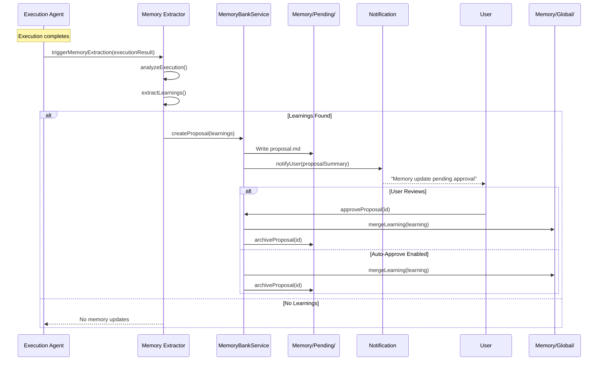

# Phase 12.5+: Memory Banks v2 Enhanced Architecture

**Document Version:** 1.1.0
**Date:** 2026-01-04
**Author:** Architecture Agent
**Status:** IN PROGRESS (Phase 12.5 ✅, Phase 12.8 ✅)
**Parent Phase:** [Phase 12: Obsidian Retirement](phase-12-obsidian-retirement.md)
**Target Release:** v1.1

---

## Table of Contents

1. [Executive Summary](#1-executive-summary)
2. [Gap Analysis: Current vs. Desired State](#2-gap-analysis)
3. [Reference Architecture Survey](#3-reference-architecture-survey)
4. [Enhanced Architecture Design](#4-enhanced-architecture-design)
5. [Data Format Decisions](#5-data-format-decisions)
6. [Embedding Reuse Strategy](#6-embedding-reuse-strategy)
7. [Implementation Phases](#7-implementation-phases)
8. [Rollback Plan](#8-rollback-plan)
9. [Success Metrics](#9-success-metrics)
10. [References](#10-references)

---

## 1. Executive Summary

This document extends the Memory Banks architecture defined in Phase 12 with advanced capabilities inspired by production memory systems (mem0, MemGPT, Zep, LangMem). The enhancements focus on:

- **Global Memory Scope** - Cross-project learnings in `Memory/Global/`
- **Agent-Driven Memory Updates** - Automated memory extraction with user notification
- **Simple RAG Implementation** - Keyword/tag-based search without external dependencies
- **Comprehensive CLI Surface** - Unified `exoctl memory` command tree
- **Integration Points** - Seamless integration with `agents/manifest` and Activity Journal

### Key Design Decisions

| Decision | Rationale |
|----------|-----------|
| **Markdown for human-readable content** | Patterns, decisions, learnings stored as `.md` for developer review |
| **JSON for structured indices** | Fast programmatic access for search and filtering |
| **No external vector DB** | Reuse `agents/embeddings/` pattern with mock vectors |
| **CLI-first interface** | Both users and agents interact via `exoctl memory` |
| **Pending → Approved workflow** | User notification before memory updates are finalized |

### Dependencies

- Phase 12.1-12.4: Memory Banks Architecture (COMPLETED ✅)
- `src/services/memory_bank.ts`: Core CRUD operations (COMPLETED ✅)
- `agents/embeddings/`: Precomputed embedding infrastructure (AVAILABLE ✅)

---

## 2. Gap Analysis

### 2.1 Current State (Phase 12.1-12.4)

| Capability | Status | Implementation |
|------------|--------|----------------|
| Project Memory | ✅ | `Memory/Projects/{portal}/` |
| Execution History | ✅ | `Memory/Execution/{trace-id}/` |
| Activity Journal Integration | ✅ | SQLite logging via `DatabaseService` |
| Search (basic) | ✅ | `searchMemory()` in MemoryBankService |
| CLI Commands | ❌ | Not implemented |
| Global Memory | ❌ | Not implemented |
| Agent Memory Updates | ❌ | Not implemented |
| Semantic/RAG Search | ❌ | Not implemented |
| User Notification | ❌ | Not implemented |

### 2.2 Desired State (Memory Banks v2)

| Capability | Priority | Phase |
|------------|----------|-------|
| Core CLI Commands | HIGH | 12.5 |
| Global Memory (`Memory/Global/`) | HIGH | 12.8 |
| Memory Promote/Demote | MEDIUM | 12.8 |
| Agent Memory Extraction | HIGH | 12.9 |
| Pending/Approval Workflow | MEDIUM | 12.9 |
| User Notification | MEDIUM | 12.9 |
| Tag-Based Search | HIGH | 12.10 |
| Simple RAG (no external deps) | LOW | 12.10 |

### 2.3 Feature Gap Summary

```
┌─────────────────────────────────────────────────────────────────┐
│                    Memory Banks Feature Gap                     │
├─────────────────────────────────────────────────────────────────┤
│  CURRENT (v1)          │  GAP              │  TARGET (v2)       │
├─────────────────────────────────────────────────────────────────┤
│  Project-scoped only   │  → Global scope   │  Global + Project  │
│  Manual updates        │  → Automation     │  Agent-driven      │
│  No CLI                │  → Full CLI       │  exoctl memory     │
│  Basic text search     │  → Tag + keyword  │  Simple RAG        │
│  Silent operations     │  → Notification   │  User approval     │
│  JSON-heavy            │  → Markdown-first │  Human-readable    │
└─────────────────────────────────────────────────────────────────┘
```

---

## 3. Reference Architecture Survey

### 3.1 Industry Memory Systems

| System | Key Innovation | Relevance to ExoFrame |
|--------|----------------|----------------------|
| **mem0** | Adaptive memory layers (user/agent/session) | Multi-scope memory hierarchy |
| **MemGPT** | Self-editing memory with archival system | Agent-managed memory updates |
| **Zep** | Temporal awareness + entity extraction | Pattern extraction from executions |
| **LangMem** | Semantic memory graphs | Tag-based relationship mapping |

### 3.2 Patterns to Adopt

1. **Memory Hierarchy (mem0)**
   - Global → Project → Execution → Session
   - Promote/demote between levels

2. **Memory Curation (MemGPT)**
   - Agent proposes memory updates
   - User approves before finalization
   - Automatic archival of stale entries

3. **Pattern Extraction (Zep)**
   - Extract learnings from execution results
   - Link related patterns across projects

4. **Simple Retrieval (LangMem)**
   - Tag-based categorization
   - Keyword search without vector DB
   - Optional embedding for fuzzy match

### 3.3 Patterns to Avoid

| Anti-Pattern | Reason | Alternative |
|--------------|--------|-------------|
| External vector database | Adds complexity, ExoFrame is self-contained | Reuse `agents/embeddings/` mock vectors |
| Graph database for relations | Over-engineering for current scope | JSON indices with tag cross-references |
| Real-time memory sync | Performance overhead | Batch updates on execution complete |
| Auto-approve all memory | Quality control issues | User notification + approval workflow |

---

## 4. Enhanced Architecture Design

### 4.1 Enhanced Directory Structure

```
Memory/
├── Global/                    # NEW: Cross-project learnings
│   ├── learnings.md           # Promoted learnings (human-readable)
│   ├── learnings.json         # Structured index for search
│   ├── patterns.md            # Global code patterns
│   └── anti-patterns.md       # What to avoid
│
├── Projects/                  # Existing: Project-specific memory
│   └── {portal-name}/
│       ├── overview.md
│       ├── patterns.md
│       ├── decisions.md
│       ├── references.md
│       └── context.json       # Structured data for search
│
├── Execution/                 # Existing: Execution history
│   └── {trace-id}/
│       ├── summary.md
│       ├── context.json
│       ├── changes.diff
│       └── learnings.md       # NEW: Extracted learnings
│
├── Pending/                   # NEW: Awaiting user approval
│   └── {timestamp}-{type}.md  # Proposed memory updates
│
├── Tasks/                     # Existing: Task tracking
│   ├── active/
│   ├── completed/
│   └── failed/
│
└── Index/                     # Enhanced: Search indices
    ├── files.json
    ├── patterns.json
    ├── tags.json
    ├── learnings.json         # NEW: Learning index
    └── embeddings/            # NEW: Optional mock embeddings
        ├── manifest.json
        └── {hash}.json
```

### 4.2 Enhanced Schemas

#### 4.2.1 Learning Schema (NEW)

```typescript
// src/schemas/memory_bank.ts

export const LearningSchema = z.object({
  id: z.string().uuid(),
  created_at: z.string().datetime(),
  source: z.enum(["execution", "user", "agent"]),
  source_id: z.string().optional().describe("trace_id or user session"),

  scope: z.enum(["global", "project"]),
  project: z.string().optional().describe("Portal name if project-scoped"),

  title: z.string().max(100),
  description: z.string().max(500),

  category: z.enum([
    "pattern",        // Code pattern learned
    "anti-pattern",   // What to avoid
    "decision",       // Architectural choice
    "insight",        // General observation
    "troubleshooting" // Problem + solution
  ]),

  tags: z.array(z.string()).max(10),

  confidence: z.enum(["low", "medium", "high"]),

  references: z.array(z.object({
    type: z.enum(["file", "execution", "url", "doc"]),
    path: z.string(),
  })).optional(),

  status: z.enum(["pending", "approved", "rejected", "archived"]),
  approved_at: z.string().datetime().optional(),
  archived_at: z.string().datetime().optional(),
});

export type Learning = z.infer<typeof LearningSchema>;
```

#### 4.2.2 Memory Update Proposal Schema (NEW)

```typescript
export const MemoryUpdateProposalSchema = z.object({
  id: z.string().uuid(),
  created_at: z.string().datetime(),

  operation: z.enum(["add", "update", "promote", "demote", "archive"]),
  target_scope: z.enum(["global", "project"]),
  target_project: z.string().optional(),

  learning: LearningSchema.omit({ status: true, approved_at: true }),

  reason: z.string().describe("Why this update is proposed"),
  agent: z.string().describe("Agent that proposed the update"),
  execution_id: z.string().optional(),

  status: z.enum(["pending", "approved", "rejected"]),
  reviewed_at: z.string().datetime().optional(),
  reviewed_by: z.enum(["user", "auto"]).optional(),
});

export type MemoryUpdateProposal = z.infer<typeof MemoryUpdateProposalSchema>;
```

#### 4.2.3 Global Memory Schema (NEW)

```typescript
export const GlobalMemorySchema = z.object({
  version: z.string(),
  updated_at: z.string().datetime(),

  learnings: z.array(LearningSchema),

  patterns: z.array(z.object({
    name: z.string(),
    description: z.string(),
    applies_to: z.array(z.string()).describe("Project patterns or 'all'"),
    examples: z.array(z.string()),
    tags: z.array(z.string()),
  })),

  anti_patterns: z.array(z.object({
    name: z.string(),
    description: z.string(),
    reason: z.string(),
    alternative: z.string(),
    tags: z.array(z.string()),
  })),

  statistics: z.object({
    total_learnings: z.number(),
    by_category: z.record(z.number()),
    by_project: z.record(z.number()),
    last_activity: z.string().datetime(),
  }),
});

export type GlobalMemory = z.infer<typeof GlobalMemorySchema>;
```

### 4.3 CLI Command Tree

```
exoctl memory
├── list                       # List all memory banks
│   └── --format json|table|md
│
├── search <query>             # Search across all memory
│   ├── --scope global|project|all
│   ├── --tags <tags>
│   ├── --category <category>
│   └── --format json|table|md
│
├── project                    # Project memory operations
│   ├── list                   # List all project memories
│   ├── show <portal>          # Show project memory details
│   ├── add-pattern <portal>   # Add pattern to project
│   ├── add-decision <portal>  # Add decision to project
│   └── export <portal>        # Export project memory
│
├── execution                  # Execution history operations
│   ├── list                   # List recent executions
│   │   ├── --portal <portal>
│   │   └── --limit <n>
│   ├── show <trace-id>        # Show execution details
│   └── extract-learnings <trace-id>  # Extract learnings
│
├── global                     # Global memory operations
│   ├── show                   # Show global memory
│   ├── add-learning           # Add global learning
│   ├── list-learnings         # List all learnings
│   └── stats                  # Show memory statistics
│
├── pending                    # Pending updates
│   ├── list                   # List pending updates
│   ├── show <id>              # Show pending update details
│   ├── approve <id>           # Approve pending update
│   ├── reject <id>            # Reject pending update
│   └── approve-all            # Approve all pending
│
├── promote <learning-id>      # Promote project→global
│   └── --from <portal>
│
├── demote <learning-id>       # Demote global→project
│   └── --to <portal>
│
└── rebuild-index              # Rebuild search indices
```

### 4.4 Agent Memory Update Workflow



### 4.5 Notification System

Memory updates notify users through:

1. **TUI Dashboard** - Badge on Memory tab
2. **CLI Output** - Message after command execution
3. **Activity Journal** - Logged for audit trail

```typescript
// src/services/notification.ts

export interface MemoryNotification {
  type: "memory_update_pending" | "memory_approved" | "memory_rejected";
  message: string;
  proposal_id: string;
  created_at: string;
}

export class NotificationService {
  async notifyMemoryUpdate(proposal: MemoryUpdateProposal): Promise<void> {
    // Log to Activity Journal
    await this.db.logEvent({
      event_type: "memory.update.pending",
      data: { proposal_id: proposal.id, reason: proposal.reason },
    });

    // Write to notification file for TUI
    const notifPath = "System/Notifications/memory.json";
    // ... append notification
  }
}
```

---

## 5. Data Format Decisions

### 5.1 Markdown vs JSON Analysis

| Content Type | Format | Rationale |
|--------------|--------|-----------|
| Project Overview | `.md` | Human-authored, needs readability |
| Patterns & Decisions | `.md` | Reviewed by developers |
| Learnings | `.md` | Narrative context important |
| Execution Summary | `.md` | Human-readable reports |
| Context Data | `.json` | Programmatic access for agents |
| Search Indices | `.json` | Fast lookup, no human editing |
| Pending Proposals | `.md` | User needs to review content |
| Statistics | `.json` | Numerical data, charting |

### 5.2 Hybrid Approach

Each memory bank component uses **paired files**:

```
Memory/Projects/my-app/
├── patterns.md          # Human-readable content
└── patterns.json        # Structured data for search
```

**Markdown Content:**
```markdown
# Code Patterns: my-app

## Error Handling Pattern

**Added:** 2026-01-04
**Tags:** error-handling, typescript

All async functions should use try-catch with typed errors:

```typescript
try {
  await operation();
} catch (error) {
  if (error instanceof AppError) {
    // handle known error
  }
  throw error;
}
```

**Files:** `src/services/*.ts`
```

**JSON Index:**
```json
{
  "portal": "my-app",
  "patterns": [
    {
      "id": "pat-001",
      "name": "Error Handling Pattern",
      "added": "2026-01-04",
      "tags": ["error-handling", "typescript"],
      "files": ["src/services/*.ts"]
    }
  ]
}
```

### 5.3 Index Synchronization

The `MemoryBankService` maintains consistency:

```typescript
async addPattern(portal: string, pattern: Pattern): Promise<void> {
  // 1. Append to patterns.md (human-readable)
  await this.appendToMarkdown(`Memory/Projects/${portal}/patterns.md`, pattern);

  // 2. Update patterns.json (machine-readable)
  await this.updateJsonIndex(`Memory/Projects/${portal}/patterns.json`, pattern);

  // 3. Update global index
  await this.updateGlobalIndex("Index/patterns.json", portal, pattern);

  // 4. Log to Activity Journal
  await this.db.logEvent({ event_type: "memory.pattern.added", ... });
}
```

---

## 6. Embedding Reuse Strategy

### 6.1 Existing Infrastructure

The `agents/embeddings/` directory contains:

- `manifest.json` - Index of all embedded documents
- `{doc}.json` - Precomputed embeddings per document
- `scripts/build_agents_embeddings.ts` - Build script with mock/OpenAI modes

**Mock Vector Generation:**
```typescript
// From scripts/build_agents_embeddings.ts
async function mockVector(text: string, dim = 64): Promise<number[]> {
  const digest = await sha256Bytes(text);
  const vec: number[] = [];
  for (let i = 0; i < dim; i++) {
    vec.push(digest[i % digest.length] / 255);
  }
  return vec;
}
```

### 6.2 Memory Bank Embedding Strategy

Reuse the same pattern for Memory Banks:

```typescript
// src/services/memory_embedding.ts

import { mockVector, chunkText } from "../../scripts/build_agents_embeddings.ts";

export class MemoryEmbeddingService {
  private readonly EMBED_DIR = "Memory/Index/embeddings";

  async embedLearning(learning: Learning): Promise<void> {
    const text = `${learning.title}\n${learning.description}`;
    const chunks = chunkText(text, 400);

    const vecs = await Promise.all(
      chunks.map(async (chunk) => ({
        text: chunk,
        vector: await mockVector(chunk, 64),
      }))
    );

    const outPath = `${this.EMBED_DIR}/${learning.id}.json`;
    await Deno.writeTextFile(outPath, JSON.stringify({
      id: learning.id,
      scope: learning.scope,
      category: learning.category,
      vecs,
    }, null, 2));

    await this.updateManifest(learning.id, outPath);
  }

  async searchByEmbedding(query: string, limit = 10): Promise<Learning[]> {
    const queryVec = await mockVector(query, 64);

    // Load all embeddings and compute cosine similarity
    const manifest = await this.loadManifest();
    const results: { id: string; score: number }[] = [];

    for (const entry of manifest.index) {
      const embedding = await this.loadEmbedding(entry.path);
      for (const vec of embedding.vecs) {
        const score = this.cosineSimilarity(queryVec, vec.vector);
        results.push({ id: embedding.id, score });
      }
    }

    // Sort by score and return top results
    results.sort((a, b) => b.score - a.score);
    const topIds = [...new Set(results.slice(0, limit).map(r => r.id))];

    return this.loadLearningsByIds(topIds);
  }

  private cosineSimilarity(a: number[], b: number[]): number {
    let dot = 0, magA = 0, magB = 0;
    for (let i = 0; i < a.length; i++) {
      dot += a[i] * b[i];
      magA += a[i] * a[i];
      magB += b[i] * b[i];
    }
    return dot / (Math.sqrt(magA) * Math.sqrt(magB));
  }
}
```

### 6.3 Search Priority

The search implementation uses a **tiered approach**:

1. **Exact tag match** - Fastest, highest relevance
2. **Keyword search** - Text contains query terms
3. **Embedding similarity** - Fuzzy match (optional, when enabled)

```typescript
async searchMemory(query: string, options: SearchOptions): Promise<SearchResult[]> {
  const results: SearchResult[] = [];

  // Tier 1: Tag match
  if (options.tags) {
    results.push(...await this.searchByTags(options.tags));
  }

  // Tier 2: Keyword search
  const keywordResults = await this.searchByKeyword(query);
  results.push(...keywordResults);

  // Tier 3: Embedding search (optional)
  if (options.useEmbeddings && keywordResults.length < options.limit) {
    const embeddingResults = await this.embeddingService.searchByEmbedding(
      query,
      options.limit - keywordResults.length
    );
    results.push(...embeddingResults);
  }

  return this.deduplicateAndRank(results, options.limit);
}
```

---

## 7. Implementation Phases

### Phase 12.5: Core CLI Commands (2 days) ✅ COMPLETED

**Goal:** Implement foundational CLI commands for Memory Banks interaction.

**Tasks:**
- [x] Create `src/cli/memory_commands.ts`
- [x] Implement `exoctl memory list`
- [x] Implement `exoctl memory search <query>`
- [x] Implement `exoctl memory project list|show`
- [x] Implement `exoctl memory execution list|show`
- [x] Add `--format json|table|md` option
- [x] Write CLI command tests
- [x] Integrate into `src/cli/exoctl.ts`

**Deliverables:**
- [x] `src/cli/memory_commands.ts` (~600 LOC)
- [x] `tests/cli/memory_commands_test.ts` (~350 LOC)
- [x] Updated `src/cli/exoctl.ts` with memory command tree

**Success Criteria:**
- [x] `exoctl memory list` returns list of all memory banks
- [x] `exoctl memory search "pattern"` returns matching entries
- [x] `exoctl memory project show my-app` displays project memory
- [x] `exoctl memory execution list --limit 10` shows recent executions
- [x] All commands support `--format json` for scripting
- [x] 100% of new CLI commands have unit tests

**Tests (22 tests implemented, all passing):**
- `memory_commands_test.ts`:
  - `memory list returns all banks` ✅
  - `memory list with projects` ✅
  - `memory list --format json outputs valid JSON` ✅
  - `memory list --format md outputs markdown` ✅
  - `memory search finds patterns` ✅
  - `memory search no results message` ✅
  - `memory search --portal filters correctly` ✅
  - `memory search --format json` ✅
  - `memory project list shows all projects` ✅
  - `memory project list empty message` ✅
  - `memory project show displays details` ✅
  - `memory project show non-existent returns error` ✅
  - `memory project show --format json` ✅
  - `memory execution list returns history` ✅
  - `memory execution list empty message` ✅
  - `memory execution list --portal filters` ✅
  - `memory execution list --limit works` ✅
  - `memory execution show displays details` ✅
  - `memory execution show non-existent returns error` ✅
  - `memory execution show --format json` ✅
  - `memory execution show --format md` ✅
  - `rebuild-index completes successfully` ✅

---

### Phase 12.8: Global Memory (2 days) ✅ COMPLETED

**Goal:** Implement cross-project memory storage and promote/demote workflow.

**Tasks:**
- [x] Create `Memory/Global/` directory structure
- [x] Implement `GlobalMemorySchema` in `src/schemas/memory_bank.ts`
- [x] Add `LearningSchema` to schemas
- [x] Implement `getGlobalMemory()` in MemoryBankService
- [x] Implement `addGlobalLearning()` in MemoryBankService
- [x] Implement `promoteLearning()` (project → global)
- [x] Implement `demoteLearning()` (global → project)
- [x] Implement CLI commands: `exoctl memory global show|list-learnings|stats`
- [x] Implement CLI commands: `exoctl memory promote|demote`
- [x] Write unit tests for all new functionality

**Deliverables:**
- [x] Updated `src/schemas/memory_bank.ts` (+100 LOC: Learning, GlobalMemory schemas)
- [x] Updated `src/services/memory_bank.ts` (+320 LOC: global memory operations)
- [x] Updated `src/cli/memory_commands.ts` (+280 LOC: global CLI commands)

**Success Criteria:**
- [x] `Memory/Global/learnings.md` contains promoted learnings
- [x] `exoctl memory global show` displays global memory
- [x] `exoctl memory promote <id> --from my-app` moves learning to global
- [x] `exoctl memory demote <id> --to my-app` moves learning to project
- [x] All promote/demote operations logged to Activity Journal
- [x] 100% of new methods have unit tests

**Tests (35 tests implemented, all passing):**
- `memory_bank_global_test.ts` (21 tests):
  - `LearningSchema validates minimal learning` ✅
  - `LearningSchema validates global learning without project` ✅
  - `LearningSchema validates pending status with references` ✅
  - `LearningSchema rejects invalid category` ✅
  - `LearningSchema rejects invalid status` ✅
  - `GlobalMemorySchema validates empty global memory` ✅
  - `GlobalMemorySchema validates populated global memory` ✅
  - `getGlobalMemory returns null for new installation` ✅
  - `initGlobalMemory creates Global directory structure` ✅
  - `getGlobalMemory returns initialized memory` ✅
  - `addGlobalLearning creates learning entry` ✅
  - `addGlobalLearning updates markdown file` ✅
  - `addGlobalLearning logs to Activity Journal` ✅
  - `promoteLearning moves from project to global` ✅
  - `promoteLearning logs to Activity Journal` ✅
  - `promoteLearning from non-existent project throws` ✅
  - `demoteLearning moves from global to project` ✅
  - `demoteLearning removes from global index` ✅
  - `demoteLearning non-existent learning throws` ✅
  - `demoteLearning to non-existent project throws` ✅
  - `getGlobalStats returns accurate statistics` ✅
- `memory_commands_global_test.ts` (14 tests):
  - `globalShow returns empty for uninitialized` ✅
  - `globalShow displays initialized memory` ✅
  - `globalShow --format json outputs valid JSON` ✅
  - `globalShow --format md outputs markdown` ✅
  - `globalListLearnings returns empty message` ✅
  - `globalListLearnings displays learnings` ✅
  - `globalListLearnings --format json outputs valid JSON` ✅
  - `globalStats displays statistics` ✅
  - `globalStats --format json outputs valid JSON` ✅
  - `promote moves learning to global` ✅
  - `promote non-existent project returns error` ✅
  - `demote moves learning to project` ✅
  - `demote non-existent learning returns error` ✅
  - `demote to non-existent project returns error` ✅

---

### Phase 12.9: Agent Memory Updates (3 days)

**Goal:** Enable agents to propose memory updates with user notification.

**Tasks:**
- [ ] Implement `MemoryUpdateProposalSchema`
- [ ] Create `src/services/memory_extractor.ts`
- [ ] Implement `analyzeExecution()` for learning extraction
- [ ] Implement `createProposal()` to write to `Memory/Pending/`
- [ ] Implement `NotificationService` for user alerts
- [ ] Implement CLI: `exoctl memory pending list|show|approve|reject`
- [ ] Integrate memory extraction into `AgentRunner` post-execution
- [ ] Add configuration option for auto-approve
- [ ] Write unit and integration tests

**Deliverables:**
- `src/services/memory_extractor.ts` (~200 LOC)
- `src/services/notification.ts` (~100 LOC)
- Updated `src/services/agent_runner.ts` (+30 LOC)
- Updated `src/cli/memory_commands.ts` (+100 LOC)

**Success Criteria:**
- [ ] After execution, learnings extracted and written to `Memory/Pending/`
- [ ] User notified via CLI output: "1 memory update pending approval"
- [ ] `exoctl memory pending list` shows pending proposals
- [ ] `exoctl memory pending approve <id>` merges learning to target scope
- [ ] `exoctl memory pending reject <id>` archives proposal
- [ ] Configuration `memory.auto_approve: true` skips pending workflow
- [ ] All operations logged to Activity Journal
- [ ] 100% of new services have unit tests

**Tests (25 tests projected):**
- `memory_extractor_test.ts`:
  - `analyzeExecution extracts learnings from success` (3)
  - `analyzeExecution extracts learnings from failure` (2)
  - `analyzeExecution returns empty for trivial execution` (1)
  - `createProposal writes to Pending directory` (2)
  - `createProposal generates valid schema` (1)
- `notification_test.ts`:
  - `notifyMemoryUpdate logs to Activity Journal` (1)
  - `notifyMemoryUpdate writes notification file` (1)
- `memory_pending_test.ts`:
  - `listPending returns all pending proposals` (1)
  - `showPending returns proposal details` (1)
  - `approvePending merges learning` (2)
  - `approvePending removes from Pending` (1)
  - `rejectPending archives proposal` (2)
  - `approveAll processes all pending` (2)
- `agent_runner_memory_test.ts`:
  - `triggers memory extraction on completion` (2)
  - `respects auto_approve configuration` (2)
- `memory_commands_pending_test.ts`:
  - `pending list shows proposals` (1)

---

### Phase 12.10: Tag-Based Search & Simple RAG (2 days)

**Goal:** Implement comprehensive search with optional embedding support.

**Tasks:**
- [ ] Implement `searchByTags()` in MemoryBankService
- [ ] Implement `searchByKeyword()` with ranking
- [ ] Create `src/services/memory_embedding.ts`
- [ ] Implement mock embedding generation (reuse `agents/embeddings/` pattern)
- [ ] Implement `cosineSimilarity()` for ranking
- [ ] Implement `searchByEmbedding()` for fuzzy match
- [ ] Add `--use-embeddings` flag to search command
- [ ] Implement `exoctl memory rebuild-index` including embeddings
- [ ] Write unit tests

**Deliverables:**
- `src/services/memory_embedding.ts` (~150 LOC)
- Updated `src/services/memory_bank.ts` (+100 LOC)
- `Memory/Index/embeddings/` directory structure

**Success Criteria:**
- [ ] `exoctl memory search "error handling" --tags typescript` returns tagged results
- [ ] `exoctl memory search "error handling" --use-embeddings` uses fuzzy match
- [ ] `exoctl memory rebuild-index` regenerates all indices including embeddings
- [ ] Search results ranked by relevance (tag match > keyword > embedding)
- [ ] Embedding generation uses deterministic mock vectors (no API calls)
- [ ] 100% of search methods have unit tests

**Tests (18 tests projected):**
- `memory_search_test.ts`:
  - `searchByTags returns matching entries` (2)
  - `searchByTags with multiple tags uses AND` (1)
  - `searchByKeyword finds text matches` (2)
  - `searchByKeyword ranks by frequency` (1)
  - `combined search uses tiered approach` (2)
- `memory_embedding_test.ts`:
  - `embedLearning creates embedding file` (2)
  - `embedLearning updates manifest` (1)
  - `searchByEmbedding returns similar entries` (2)
  - `cosineSimilarity calculates correctly` (2)
  - `mock vectors are deterministic` (1)
- `rebuild_index_test.ts`:
  - `rebuild-index regenerates all indices` (1)
  - `rebuild-index includes embeddings` (1)

---

### Phase 12.11: Integration & Documentation (1 day)

**Goal:** Final integration, documentation update, and validation.

**Tasks:**
- [ ] Update `docs/Memory_Banks.md` with v2 features
- [ ] Update `docs/ExoFrame_Architecture.md` with new diagrams
- [ ] Update `docs/ExoFrame_User_Guide.md` with CLI reference
- [ ] Add Memory Banks section to `README.md`
- [ ] Integration tests for full workflow
- [ ] Performance validation (search < 100ms, embed < 500ms)
- [ ] Update `agents/manifest.json` with memory integration

**Deliverables:**
- Updated documentation (5 files)
- Integration test suite
- Performance benchmarks

**Success Criteria:**
- [ ] All documentation reflects v2 architecture
- [ ] Integration tests pass end-to-end workflow
- [ ] Performance benchmarks meet targets
- [ ] `exoctl memory --help` shows complete command tree
- [ ] No grep matches for outdated Memory Banks references

**Tests (10 tests projected):**
- `memory_integration_test.ts`:
  - `full workflow: execution → extract → approve → search` (3)
  - `promote workflow: project → global` (2)
  - `search workflow: tag + keyword + embedding` (2)
  - `CLI workflow: complete command sequence` (3)

---

## 8. Rollback Plan

| Phase | Rollback Strategy |
|-------|-------------------|
| 12.5 | Remove CLI commands, revert `src/cli/` |
| 12.8 | Delete `Memory/Global/`, remove schemas |
| 12.9 | Remove extractor service, revert AgentRunner |
| 12.10 | Delete embedding service, remove indices |
| 12.11 | Revert documentation changes |

**Critical Checkpoint:** After Phase 12.9, rollback becomes complex. Ensure 12.5 and 12.8 are stable before proceeding.

---

## 9. Success Metrics

### 9.1 Code Quality

| Metric | Target | Measurement |
|--------|--------|-------------|
| Test Coverage | ≥ 80% line, ≥ 75% branch | `deno coverage` |
| New Tests | ≥ 88 tests added | Test count delta |
| LOC Added | ~900 LOC | `wc -l` on new files |

### 9.2 Functionality

| Metric | Target | Measurement |
|--------|--------|-------------|
| CLI Commands | 20+ commands | Command tree count |
| Search Latency | < 100ms | Benchmark test |
| Embedding Latency | < 500ms | Benchmark test |
| Zero Regressions | 0 failures | Full test suite |

### 9.3 User Experience

| Metric | Target | Measurement |
|--------|--------|-------------|
| CLI Discoverability | 100% commands have help | `--help` coverage |
| Notification Delivery | 100% proposals notified | Integration test |
| Format Options | 3 formats (json/table/md) | CLI validation |

---

## 10. References

### 10.1 Internal Documents

- [Phase 12: Obsidian Retirement](phase-12-obsidian-retirement.md) - Parent phase
- [docs/Memory_Banks.md](../../docs/Memory_Banks.md) - Current architecture
- [docs/ExoFrame_Architecture.md](../../docs/ExoFrame_Architecture.md) - System diagrams
- [agents/embeddings/](../embeddings/) - Existing embedding infrastructure

### 10.2 External References

- [mem0 Documentation](https://docs.mem0.ai/) - Adaptive memory layers
- [MemGPT Paper](https://arxiv.org/abs/2310.08560) - Self-editing memory
- [Zep Memory](https://docs.getzep.com/) - Temporal awareness
- [LangChain Memory](https://python.langchain.com/docs/modules/memory/) - Memory patterns

### 10.3 Code References

| File | Purpose |
|------|---------|
| `src/schemas/memory_bank.ts` | Zod schemas for memory structures |
| `src/services/memory_bank.ts` | Core CRUD operations |
| `scripts/build_agents_embeddings.ts` | Embedding generation pattern |
| `src/services/database.ts` | Activity Journal integration |

---

## Appendix A: Full Test Inventory

| Phase | Test File | Test Count |
|-------|-----------|------------|
| 12.5 | `tests/cli/memory_commands_test.ts` | 20 |
| 12.8 | `tests/services/memory_bank_global_test.ts` | 12 |
| 12.8 | `tests/cli/memory_commands_global_test.ts` | 3 |
| 12.9 | `tests/services/memory_extractor_test.ts` | 9 |
| 12.9 | `tests/services/notification_test.ts` | 2 |
| 12.9 | `tests/services/memory_pending_test.ts` | 9 |
| 12.9 | `tests/services/agent_runner_memory_test.ts` | 4 |
| 12.9 | `tests/cli/memory_commands_pending_test.ts` | 1 |
| 12.10 | `tests/services/memory_search_test.ts` | 8 |
| 12.10 | `tests/services/memory_embedding_test.ts` | 8 |
| 12.10 | `tests/services/rebuild_index_test.ts` | 2 |
| 12.11 | `tests/integration/memory_integration_test.ts` | 10 |
| **Total** | | **88** |

---

## Appendix B: CLI Command Reference

```bash
# List all memory banks
exoctl memory list
exoctl memory list --format json

# Search memory
exoctl memory search "authentication"
exoctl memory search "error" --tags typescript --scope project
exoctl memory search "pattern" --use-embeddings

# Project memory
exoctl memory project list
exoctl memory project show my-app
exoctl memory project add-pattern my-app
exoctl memory project add-decision my-app

# Execution history
exoctl memory execution list
exoctl memory execution list --portal my-app --limit 10
exoctl memory execution show 550e8400-e29b-41d4-a716-446655440000
exoctl memory execution extract-learnings 550e8400-e29b-41d4-a716-446655440000

# Global memory
exoctl memory global show
exoctl memory global add-learning
exoctl memory global list-learnings
exoctl memory global stats

# Pending updates
exoctl memory pending list
exoctl memory pending show pending-001
exoctl memory pending approve pending-001
exoctl memory pending reject pending-001
exoctl memory pending approve-all

# Promote/demote
exoctl memory promote learning-001 --from my-app
exoctl memory demote learning-002 --to my-app

# Maintenance
exoctl memory rebuild-index
```
