# ExoFrame Architecture

**Version:** 1.11.0\
**Date:** January 4, 2026

This document provides a comprehensive architectural overview of ExoFrame components using Mermaid diagrams.

---

## System Architecture Overview


---

## Request Processing Flow

```mermaid
sequenceDiagram
    participant U as User
    participant CLI as exoctl CLI
    participant I as Inbox/Requests
    participant W as File Watcher
    participant RP as Request Processor
    participant RR as Request Router
    participant FV as Flow Validator
    participant AR as Agent Runner
    participant FR as Flow Runner
    participant AI as AI Provider
    participant PA as Plan Adapter
    participant PS as Plan Schema
    participant P as Inbox/Plans
    participant DB as Activity Journal

    U->>CLI: exoctl request "Fix bug"
    CLI->>I: Create request-{uuid}.md
    CLI->>DB: Log request.created
    CLI-->>U: Request created ✓

    W->>I: Detect new file
    W->>RP: Trigger processing
    RP->>I: Read request.md
    RP->>RR: Route request (flow vs agent)

    alt Flow Request
        RR->>FV: Validate flow exists
        FV->>FV: Check flow schema & dependencies
        FV-->>RR: Flow valid ✓
        RR->>FR: Generate flow execution plan
        FR->>AI: Generate plan (JSON)
        FR->>PA: Parse & Validate
        PA->>PS: Validate against Zod Schema
    else Agent Request
        RR->>AR: Load agent blueprint
        AR->>AI: Generate plan
        AI-->>AR: Plan response (JSON)
        AR->>PA: Parse & Validate
        PA->>PS: Validate against Zod Schema
    end

    alt Validation Success
        PS-->>PA: Valid Plan Object
        PA->>PA: Convert to Markdown
        PA-->>RP: Markdown Content
        RP->>P: Write plan-{uuid}.md
        RP->>DB: Log plan.generated
        P-->>U: Ready for review
    else Validation Failed
        PS-->>PA: Zod Validation Error
        PA-->>RP: PlanValidationError
        RP->>DB: Log plan.validation_failed
    end

    U->>CLI: exoctl plan list
    CLI->>P: Read plans
    CLI-->>U: Show pending plans

    U->>CLI: exoctl plan approve {uuid}
    CLI->>P: Update plan status
    CLI->>DB: Log plan.approved
    CLI-->>U: Approved ✓
```



---

## Flow-Aware Request Routing

The **Request Router** service enables intelligent routing of requests based on their frontmatter configuration. It supports both single-agent execution (legacy) and multi-agent flow execution (Phase 7).

### Routing Decision Flow


### Request Types

**Flow Request (Multi-Agent):**

```yaml
---
trace_id: "550e8400-e29b-41d4-a716-446655440000"
flow: code-review
tags: [review, security]
---
Please perform a comprehensive code review of this pull request.
```

**Agent Request (Single-Agent):**

```yaml
---
trace_id: "550e8400-e29b-41d4-a716-446655440001"
agent: senior-coder
tags: [implementation]
---
Implement the new authentication feature.
```

**Default Agent Request:**

```yaml
---
trace_id: "550e8400-e29b-41d4-a716-446655440002"
tags: [general]
---
Help me understand this codebase.
```

### Flow Validation

Before routing to FlowRunner, the Request Router validates:

- **Flow Existence:** Flow blueprint exists in `/Blueprints/Flows/`
- **Schema Validity:** Flow conforms to expected structure
- **Dependencies:** All referenced agents and transforms exist
- **No Cycles:** Flow doesn't contain circular dependencies

---

## Parsing & Schema Layer

ExoFrame centralizes file-format parsing and validation into two layers:

- **Parsers** (`src/parsers/`): extract structure from Markdown files (YAML frontmatter + body).
- **Schemas** (`src/schemas/`): validate structured objects using Zod (requests, plans, flows, portals, MCP).

Key modules:

- `src/parsers/markdown.ts` (`FrontmatterParser`)
  - Extracts YAML frontmatter delimited by `--- ... ---`.
  - Validates frontmatter using `src/schemas/request.ts`.
  - Optionally logs validation events to the Activity Journal via `DatabaseService`.
- `src/schemas/plan_schema.ts`
  - Defines the JSON schema for LLM plan output (title/description + numbered steps + optional metadata).
- `src/schemas/mcp.ts`
  - Defines MCP tool argument schemas and MCP server configuration schema.

This layer is what keeps file-driven workflows safe and deterministic: request/plan files may come from humans or LLMs, but the runtime only proceeds when schemas validate.

---

## Plan Execution Flow

The **Plan Executor** service orchestrates the step-by-step execution of approved plans. It uses a ReAct-style loop to prompt the LLM for actions, executes them via the **Tool Registry**, and commits changes to Git after each step.


### Plan Execution Components


### MCP Server Implementation Notes

The MCP server lives under `src/mcp/` and is a JSON-RPC 2.0 server over stdio.

- `src/mcp/server.ts`
  - Routes: `initialize`, `tools/list`, `tools/call`, `resources/list`, `resources/read`, `prompts/list`, `prompts/get`.
  - Logs lifecycle events (e.g., `mcp.server.started`) to the Activity Journal.
- `src/mcp/tools.ts`
  - Validates tool input using `src/schemas/mcp.ts` and enforces portal access via `PortalPermissionsService`.
  - Applies path safety checks (no traversal/absolute paths; resolved path must remain within the portal root).
- `src/mcp/resources.ts`
  - Implements `portal://<PortalAlias>/<path>` resource discovery and reading.

### Plan File Structure

```mermaid
graph TB
    subgraph PlanFile["_plan.md Structure"]
        FM[YAML Frontmatter<br/>---<br/>trace_id: uuid<br/>request_id: uuid<br/>agent: string<br/>status: approved<br/>---]
        Body[Markdown Body<br/># Plan Title<br/>Description]
        Step1[## Step 1: Title<br/>Content and tasks]
        Step2[## Step 2: Title<br/>Content and tasks]
        StepN[## Step N: Title<br/>Content and tasks]
    end

    subgraph Parsed["Parsed Structure"]
        Context[Context Object<br/>{trace_id, request_id,<br/>agent, status}]
        Steps[Steps Array<br/>[{number, title, content}]]
    end

    FM --> Context
    Body --> Context
    Step1 --> Steps
    Step2 --> Steps
    StepN --> Steps

    Context --> Execution[Plan Executor]
    Steps --> Execution

    classDef file fill:#e1f5ff,stroke:#01579b,stroke-width:2px
    classDef parsed fill:#c8e6c9,stroke:#388e3c,stroke-width:2px
    classDef exec fill:#f3e5f5,stroke:#4a148c,stroke-width:2px

    class FM,Body,Step1,Step2,StepN file
    class Context,Steps parsed
    class Execution exec
```

### Activity Logging Events

**Detection Events:**

- `plan.detected` - Plan file found in System/Active
- `plan.ready_for_execution` - Valid plan parsed, ready for execution
- `plan.invalid_frontmatter` - YAML parsing failed
- `plan.missing_trace_id` - Required trace_id field not found
- `plan.detection_failed` - Unexpected error during detection

**Parsing Events:**

- `plan.parsed` - Plan successfully parsed with step count
- `plan.parsing_failed` - Missing body, no steps, or empty titles
- `plan.non_sequential_steps` - Warning for gaps in step numbering

---

## CLI Commands Architecture


---

## TUI Dashboard Architecture

The dashboard is an interactive terminal UI launched from the CLI, providing a unified cockpit for ExoFrame operations.

### Overview

- **Entry point:** `exoctl dashboard` → `src/cli/dashboard_commands.ts` → `src/tui/tui_dashboard.ts`
- **Multi-pane support:** Split views with independent focus management
- **7 integrated views:** Portal Manager, Plan Reviewer, Monitor, Daemon Control, Agent Status, Request Manager, Memory View
- **Test stability:** Mock services enable comprehensive testing (see `src/tui/tui_dashboard_mocks.ts`)

### Component Architecture

```mermaid
graph TB
    subgraph CLI[CLI Layer]
        Exoctl[exoctl.ts]
        DashCmd[DashboardCommands.show]
    end

    subgraph Dashboard[TUI Dashboard]
        Launch[launchTuiDashboard]
        State[DashboardViewState]
        Theme[TuiTheme]
    end

    subgraph Panes[Pane Management]
        PaneList[Panes Array]
        Focus[Active Pane Focus]
        Layout[Layout Persistence]
    end

    subgraph Views[Dashboard Views]
        Portal[🌀 PortalManagerView]
        Plan[📋 PlanReviewerView]
        Monitor[📊 MonitorView]
        Daemon[⚙️ DaemonControlView]
        Agent[🤖 AgentStatusView]
        Request[📥 RequestManagerView]
        Memory[💾 MemoryView]
    end

    subgraph Infrastructure[Shared Infrastructure]
        Colors[tui_colors.ts<br/>Theme & colorize]
        Help[tui_help.ts<br/>Help overlays]
        Session[tui_session_base.ts<br/>Base class]
        Raw[Raw mode handling]
    end

    subgraph Notifications[Notification System]
        NotifPanel[Notification Panel]
        NotifTypes[info/success/warning/error]
        AutoExpire[Auto-expire timers]
    end

    Exoctl --> DashCmd --> Launch
    Launch --> State
    Launch --> Theme
    Launch --> PaneList
    PaneList --> Focus
    PaneList --> Layout
    Focus --> Views
    Views --> Infrastructure
    Launch --> Notifications
```



### Dashboard State

The `DashboardViewState` manages global UI state:

```typescript
interface DashboardViewState {
  showHelp: boolean; // Help overlay visible
  showNotifications: boolean; // Notification panel visible
  showViewPicker: boolean; // View picker dialog visible
  isLoading: boolean; // Loading indicator
  loadingMessage: string; // Loading message text
  error: string | null; // Error message
  notifications: Notification[]; // Active notifications
  currentTheme: string; // "dark" | "light"
  highContrast: boolean; // Accessibility mode
  screenReader: boolean; // Screen reader support
}
```

### Pane Structure

Each pane manages a view instance with layout information:

```typescript
interface Pane {
  id: string;           // Unique pane identifier
  view: View;           // View instance (PortalManagerView, etc.)
  x: number;            // X position in grid
  y: number;            // Y position in grid
  width: number;        // Pane width (columns)
  height: number;       // Pane height (rows)
  focused: boolean;     // Currently focused
  maximized?: boolean;  // Zoom state
  previousBounds?: {...}; // For restore after maximize
}
```

### Key Bindings

Dashboard uses a declarative key binding system:

| Category        | Keys                      | Actions                           |
| --------------- | ------------------------- | --------------------------------- |
| **Navigation**  | `Tab`, `Shift+Tab`, `1-7` | Pane switching                    |
| **Layout**      | `v`, `h`, `c`, `z`        | Split, close, maximize            |
| **Persistence** | `s`, `r`, `d`             | Save, restore, default            |
| **Dialogs**     | `?`, `n`, `p`, `Esc/q`    | Help, notifications, picker, quit |

### Layout Persistence

Layouts are saved to `~/.exoframe/tui_layout.json`:

```json
{
  "panes": [
    { "id": "main", "viewName": "PortalManagerView", "x": 0, "y": 0, "width": 40, "height": 24 },
    { "id": "pane-1", "viewName": "MonitorView", "x": 40, "y": 0, "width": 40, "height": 24 }
  ],
  "activePaneId": "main",
  "version": "1.1"
}
```

### View Integration

Each view extends `TuiSessionBase` and implements:

- `render()`: View-specific rendering
- `handleKey(key: string)`: Keyboard input handling
- `getFocusableElements()`: List of focusable UI elements
- Service injection for data access

### Raw Mode Handling

Terminal raw mode enables immediate key response:

```typescript
tryEnableRawMode(); // Enable for interactive mode
tryDisableRawMode(); // Restore on exit
```

Falls back to line-based input when raw mode unavailable.

### Testing Strategy

- **Unit tests:** Mock services for isolated view testing
- **Integration tests:** Full dashboard lifecycle with test mode
- **Sanitizer safety:** Test mode skips timers to prevent leaks
- **Coverage:** 591+ TUI tests across all components

For keyboard shortcuts, see [TUI Keyboard Reference](./TUI_Keyboard_Reference.md).

---

## AI Provider Architecture


---

## Storage & Data Flow


---

## Memory Banks Architecture

The Memory Banks system provides persistent knowledge storage for project context, execution history, and cross-project learnings.

> **Enhanced Architecture:** See [agents/planning/phase-12.5-memory-bank-enhanced.md](../agents/planning/phase-12.5-memory-bank-enhanced.md) for the full v2 architecture with Global Memory, Agent Memory Updates, and Simple RAG.

### Directory Structure


### Memory Update Workflow


### CLI Command Tree

```
exoctl memory
├── list                    # List all memory banks
├── search <query>          # Search across memory
├── project list|show       # Project memory ops
├── execution list|show     # Execution history
├── global show|stats       # Global memory
├── pending list|approve    # Pending updates
├── promote|demote          # Move learnings
└── rebuild-index           # Regenerate indices
```

### Key Components

| Component         | Location                                       | Purpose                      | Status      |
| ----------------- | ---------------------------------------------- | ---------------------------- | ----------- |
| MemoryBankService | `src/services/memory_bank.ts`                  | Core CRUD operations         | ✅ Complete |
| Memory Schemas    | `src/schemas/memory_bank.ts`                   | Zod validation schemas       | ✅ Complete |
| Memory Extractor  | `src/services/memory_extractor.ts`             | Learning extraction          | ✅ Complete |
| Memory Embedding  | `src/services/memory_embedding.ts`             | Vector embeddings for search | ✅ Complete |
| Memory CLI        | `src/cli/memory_commands.ts`                   | CLI interface                | ✅ Complete |
| Integration Tests | `tests/integration/memory_integration_test.ts` | End-to-end tests             | ✅ Complete |

---

## Portal System Architecture


---

## Blueprint Management System


---

## Daemon Lifecycle


---

## Activity Journal Flow


---

## Key Design Principles

### 1. **Files as API**

- Request input: Markdown files in `Inbox/Requests`
- Plan output: Markdown files in `Inbox/Plans`
- Configuration: TOML with Zod validation
- Context: File system is source of truth

### 2. **Separation of Concerns**

- **CLI Layer**: Human interface (exoctl)
- **Core Layer**: Daemon orchestration (main.ts, watcher)
- **Service Layer**: Business logic (processors, runners)
- **Storage Layer**: SQLite + file system

### 3. **Auditability**

- Every action logged to Activity Journal
- Trace ID links: request → plan → changeset → commit
- Git commit footers with `Exo-Trace` metadata
- Immutable event stream for compliance

### 4. **Multi-Provider Support**

- Local-first: Ollama (no cloud required)
- Cloud options: Claude, GPT, Gemini
- Mock provider for testing
- Provider factory pattern for extensibility

### 5. **Portal System**

- Symlink-based external project access
- Context cards for agent understanding
- Scoped permissions (Deno security model)
- Multi-project refactoring support

---

## Component Responsibilities

| Component              | Responsibility                     | Key Files                           |
| ---------------------- | ---------------------------------- | ----------------------------------- |
| **CLI Layer**          | Human interface for system control | `src/cli/*.ts`                      |
| **Daemon**             | Background orchestration engine    | `src/main.ts`                       |
| **Request Watcher**    | Detect new requests in Inbox       | `src/services/watcher.ts`           |
| **Plan Watcher**       | Detect approved plans              | `src/services/watcher.ts`           |
| **Request Processor**  | Parse requests, generate plans     | `src/services/request_processor.ts` |
| **Plan Executor**      | Execute approved plans             | `src/services/plan_executor.ts`     |
| **Agent Runner**       | Execute agent logic with LLM       | `src/services/agent_runner.ts`      |
| **Event Logger**       | Write to Activity Journal          | `src/services/event_logger.ts`      |
| **Config Service**     | Load and validate exo.config.toml  | `src/config/service.ts`             |
| **Database Service**   | SQLite journal.db operations       | `src/services/db.ts`                |
| **Git Service**        | Git operations with trace metadata | `src/services/git_service.ts`       |
| **Provider Factory**   | Create LLM provider instances      | `src/ai/provider_factory.ts`        |
| **Context Loader**     | Load context for agent execution   | `src/services/context_loader.ts`    |
| **Portal Commands**    | Manage external project access     | `src/cli/portal_commands.ts`        |
| **Blueprint Commands** | Manage agent templates             | `src/cli/blueprint_commands.ts`     |
| **Dashboard Commands** | Launch terminal dashboard          | `src/cli/dashboard_commands.ts`     |
| **TUI Dashboard**      | Multi-view terminal UI             | `src/tui/*.ts`                      |
| **Parsers**            | Parse markdown + frontmatter       | `src/parsers/*.ts`                  |
| **Schemas**            | Zod validation layer               | `src/schemas/*.ts`                  |
| **MCP Server**         | JSON-RPC server for tool execution | `src/mcp/server.ts`                 |

---

## Developer Tooling Architecture

ExoFrame includes repository tooling under `scripts/` to keep development workflows deterministic.

### agents/ Knowledge Base Index & Embeddings

ExoFrame includes a developer-facing knowledge base under `agents/` used to keep AI assistants consistent and repository-aware.

Artifacts:

- `agents/manifest.json`: index of agent docs with metadata and chunk references
- `agents/chunks/*`: chunked doc text used for retrieval
- `agents/embeddings/*`: embedding vectors (often mocked in CI) used for semantic search

Build/validation scripts:

- `scripts/build_agents_index.ts`: rebuilds `agents/manifest.json` and chunks
- `scripts/build_agents_embeddings.ts`: regenerates embeddings (`--mode mock` for deterministic CI)
- `scripts/verify_manifest_fresh.ts`: checks manifest/chunks are up to date
- `scripts/validate_agents_docs.ts`: validates agent-doc frontmatter/schema

### CI, Scaffolding, and Database Tooling

- `scripts/ci.ts`: orchestrates repository checks and tests in CI-like environments
- `scripts/scaffold.sh`: scaffolds a new ExoFrame workspace folder structure and templates
- `scripts/setup_db.ts`: initializes `journal.db` schema
- `scripts/migrate_db.ts` + `migrations/*.sql`: applies incremental database migrations

---

## Viewing This Document

### VS Code

- Built-in Mermaid preview (Markdown Preview Enhanced extension recommended)
- Right-click → "Open Preview" or press `Ctrl+Shift+V`

### GitHub/GitLab

- Native Mermaid rendering in markdown files

### Mermaid Live Editor

- https://mermaid.live/
- Copy/paste diagram code for editing

### Export Options

- PNG/SVG export via Mermaid Live Editor
- PDF export via VS Code extensions
- HTML with mermaid.js for web viewing

---

## Related Documentation

- **[Implementation Plan](ExoFrame_Implementation_Plan.md)** - Detailed development roadmap
- **[User Guide](ExoFrame_User_Guide.md)** - End-user documentation
- **[Technical Spec](ExoFrame_Technical_Spec.md)** - Deep technical details
- **[White Paper](ExoFrame_White_paper.md)** - Vision and philosophy
- **[Building with AI Agents](Building_with_AI_Agents.md)** - Development patterns
