# ExoFrame Architecture

**Version:** 1.8.0\
**Date:** December 3, 2025

This document provides a comprehensive architectural overview of ExoFrame components using Mermaid diagrams.

---

## System Architecture Overview

```mermaid
graph TB
    subgraph Actors["👥 Actors"]
        User[👤 User/Developer]
        Agent[🤖 AI Agent]
    end

    subgraph CLI["🖥️ CLI Layer"]
        Exoctl[exoctl CLI Entry]
        ReqCmd[Request Commands]
        PlanCmd[Plan Commands]
        ChangeCmd[Changeset Commands]
        GitCmd[Git Commands]
        DaemonCmd[Daemon Commands]
        PortalCmd[Portal Commands]
        BlueprintCmd[Blueprint Commands]
    end

    subgraph Core["⚙️ Core System"]
        Main[main.ts - Daemon]
        ReqWatch[Request Watcher<br/>Inbox/Requests]
        PlanWatch[Plan Watcher<br/>System/Active]
        ReqProc[Request Processor]
        PlanExec[Plan Executor]
        AgentRun[Agent Runner]
        FlowEng[Flow Engine]
        ExecLoop[Execution Loop]
    end

    subgraph Services["🔧 Services"]
        ConfigSvc[Config Service]
        DBSvc[Database Service]
        GitSvc[Git Service]
        EventLog[Event Logger]
        ContextLoad[Context Loader]
        PlanWriter[Plan Writer]
        PlanAdapter[Plan Adapter]
        MissionRpt[Mission Reporter]
        PathRes[Path Resolver]
        ToolReg[Tool Registry]
        CtxCard[Context Card Generator]
    end

    subgraph Storage["💾 Storage"]
        DB[(SQLite DB<br/>journal.db)]
        FS[/File System<br/>~/ExoFrame/]
        Inbox[/Inbox/<br/>Requests & Plans/]
        Blueprint[/Blueprints/<br/>Agents & Flows/]
        Knowledge[/Knowledge/<br/>Context Cards/]
        Portals[/Portals/<br/>External Projects/]
        System[/System/<br/>Active & Archive/]
    end

    subgraph AI["🤖 AI Providers"]
        Factory[Provider Factory]
        Ollama[Ollama<br/>Local]
        Claude[Claude API<br/>Anthropic]
        GPT[OpenAI GPT<br/>Remote]
        Gemini[Google Gemini<br/>Remote]
        Mock[Mock Provider<br/>Testing]
    end

    %% User interactions
    User -->|CLI Commands| Exoctl
    User -->|Drop .md files| Inbox
    Agent -->|Read/Write| Portals

    %% CLI routing
    Exoctl --> ReqCmd
    Exoctl --> PlanCmd
    Exoctl --> ChangeCmd
    Exoctl --> GitCmd
    Exoctl --> DaemonCmd
    Exoctl --> PortalCmd
    Exoctl --> BlueprintCmd

    %% CLI to Services
    ReqCmd --> Inbox
    PlanCmd --> Inbox
    ChangeCmd --> GitSvc
    GitCmd --> GitSvc
    DaemonCmd --> Main
    PortalCmd --> ConfigSvc
    PortalCmd --> CtxCard
    BlueprintCmd --> Blueprint

    %% Core daemon flow
    Main --> ConfigSvc
    Main --> DBSvc
    Main --> Factory
    Main --> ReqWatch
    Main --> PlanWatch
    Main --> ReqProc
    Main --> PlanExec
    ReqWatch --> Inbox
    PlanWatch --> System
    ReqProc --> AgentRun
    PlanExec --> AgentRun
    AgentRun --> ExecLoop
    ExecLoop --> FlowEng

    %% Services integration
    AgentRun --> ContextLoad
    AgentRun --> PlanWriter
    AgentRun --> MissionRpt
    AgentRun --> EventLog
    ExecLoop --> ToolReg
    ExecLoop --> GitSvc
    ContextLoad --> Knowledge
    ContextLoad --> Portals
    PlanWriter --> Inbox
    PlanWriter --> PlanAdapter
    EventLog --> DB
    GitSvc --> FS
    PathRes --> FS

    %% AI Provider routing
    Factory --> Ollama
    Factory --> Claude
    Factory --> GPT
    Factory --> Gemini
    Factory --> Mock
    AgentRun --> Factory

    %% Storage access
    ConfigSvc --> FS
    DBSvc --> DB
    ReqProc --> Blueprint
    Watcher --> System

    %% Styling
    classDef actor fill:#e1f5ff,stroke:#01579b,stroke-width:2px
    classDef cli fill:#fff3e0,stroke:#e65100,stroke-width:2px
    classDef core fill:#f3e5f5,stroke:#4a148c,stroke-width:2px
    classDef service fill:#e8f5e9,stroke:#1b5e20,stroke-width:2px
    classDef storage fill:#fff9c4,stroke:#f57f17,stroke-width:2px
    classDef ai fill:#fce4ec,stroke:#880e4f,stroke-width:2px

    class User,Agent actor
    class Exoctl,ReqCmd,PlanCmd,ChangeCmd,GitCmd,DaemonCmd,PortalCmd,BlueprintCmd cli
    class Main,ReqWatch,PlanWatch,ReqProc,PlanExec,AgentRun,FlowEng,ExecLoop core
    class ConfigSvc,DBSvc,GitSvc,EventLog,ContextLoad,PlanWriter,MissionRpt,PathRes,ToolReg,CtxCard service
    class DB,FS,Inbox,Blueprint,Knowledge,Portals,System storage
    class Factory,Ollama,Claude,GPT,Gemini,Mock ai
```



---

## Request Processing Flow


---

## Plan Execution Flow

The **Plan Executor** service orchestrates the step-by-step execution of approved plans. It uses a ReAct-style loop to prompt the LLM for actions, executes them via the **Tool Registry**, and commits changes to Git after each step.


### Plan Execution Components


### Plan File Structure

```mermaid
graph TB
    subgraph PlanFile["_plan.md Structure"]
        FM[YAML Frontmatter<br/>---<br/>trace_id: uuid<br/>request_id: uuid<br/>agent: string<br/>status: approved<br/>---]
        Body[Markdown Body<br/># Plan Title<br/>Description]
        Step1[## Step 1: Title<br/>Content and tasks]
        Step2[## Step 2: Title<br/>Content and tasks]
        StepN[## Step N: Title<br/>Content and tasks]
    end

    subgraph Parsed["Parsed Structure"]
        Context[Context Object<br/>{trace_id, request_id,<br/>agent, status}]
        Steps[Steps Array<br/>[{number, title, content}]]
    end

    FM --> Context
    Body --> Context
    Step1 --> Steps
    Step2 --> Steps
    StepN --> Steps

    Context --> Execution[Plan Executor]
    Steps --> Execution

    classDef file fill:#e1f5ff,stroke:#01579b,stroke-width:2px
    classDef parsed fill:#c8e6c9,stroke:#388e3c,stroke-width:2px
    classDef exec fill:#f3e5f5,stroke:#4a148c,stroke-width:2px

    class FM,Body,Step1,Step2,StepN file
    class Context,Steps parsed
    class Execution exec
```

### Activity Logging Events

**Detection Events:**

- `plan.detected` - Plan file found in System/Active
- `plan.ready_for_execution` - Valid plan parsed, ready for execution
- `plan.invalid_frontmatter` - YAML parsing failed
- `plan.missing_trace_id` - Required trace_id field not found
- `plan.detection_failed` - Unexpected error during detection

**Parsing Events:**

- `plan.parsed` - Plan successfully parsed with step count
- `plan.parsing_failed` - Missing body, no steps, or empty titles
- `plan.non_sequential_steps` - Warning for gaps in step numbering

---

## CLI Commands Architecture


---

## AI Provider Architecture


---

## Storage & Data Flow


---

## Portal System Architecture


---

## Blueprint Management System


---

## Daemon Lifecycle


---

## Activity Journal Flow


---

## Key Design Principles

### 1. **Files as API**

- Request input: Markdown files in `Inbox/Requests`
- Plan output: Markdown files in `Inbox/Plans`
- Configuration: TOML with Zod validation
- Context: File system is source of truth

### 2. **Separation of Concerns**

- **CLI Layer**: Human interface (exoctl)
- **Core Layer**: Daemon orchestration (main.ts, watcher)
- **Service Layer**: Business logic (processors, runners)
- **Storage Layer**: SQLite + file system

### 3. **Auditability**

- Every action logged to Activity Journal
- Trace ID links: request → plan → changeset → commit
- Git commit footers with `Exo-Trace` metadata
- Immutable event stream for compliance

### 4. **Multi-Provider Support**

- Local-first: Ollama (no cloud required)
- Cloud options: Claude, GPT, Gemini
- Mock provider for testing
- Provider factory pattern for extensibility

### 5. **Portal System**

- Symlink-based external project access
- Context cards for agent understanding
- Scoped permissions (Deno security model)
- Multi-project refactoring support

---

## Component Responsibilities

| Component              | Responsibility                     | Key Files                           |
| ---------------------- | ---------------------------------- | ----------------------------------- |
| **CLI Layer**          | Human interface for system control | `src/cli/*.ts`                      |
| **Daemon**             | Background orchestration engine    | `src/main.ts`                       |
| **Request Watcher**    | Detect new requests in Inbox       | `src/services/watcher.ts`           |
| **Plan Watcher**       | Detect approved plans              | `src/services/watcher.ts`           |
| **Request Processor**  | Parse requests, generate plans     | `src/services/request_processor.ts` |
| **Plan Executor**      | Execute approved plans             | `src/main.ts` (in-progress)         |
| **Agent Runner**       | Execute agent logic with LLM       | `src/services/agent_runner.ts`      |
| **Event Logger**       | Write to Activity Journal          | `src/services/event_logger.ts`      |
| **Config Service**     | Load and validate exo.config.toml  | `src/config/service.ts`             |
| **Database Service**   | SQLite journal.db operations       | `src/services/db.ts`                |
| **Git Service**        | Git operations with trace metadata | `src/services/git_service.ts`       |
| **Provider Factory**   | Create LLM provider instances      | `src/ai/provider_factory.ts`        |
| **Context Loader**     | Load context for agent execution   | `src/services/context_loader.ts`    |
| **Portal Commands**    | Manage external project access     | `src/cli/portal_commands.ts`        |
| **Blueprint Commands** | Manage agent templates             | `src/cli/blueprint_commands.ts`     |

---

## Viewing This Document

### VS Code

- Built-in Mermaid preview (Markdown Preview Enhanced extension recommended)
- Right-click → "Open Preview" or press `Ctrl+Shift+V`

### GitHub/GitLab

- Native Mermaid rendering in markdown files

### Mermaid Live Editor

- https://mermaid.live/
- Copy/paste diagram code for editing

### Export Options

- PNG/SVG export via Mermaid Live Editor
- PDF export via VS Code extensions
- HTML with mermaid.js for web viewing

---

## Related Documentation

- **[Implementation Plan](ExoFrame_Implementation_Plan.md)** - Detailed development roadmap
- **[User Guide](ExoFrame_User_Guide.md)** - End-user documentation
- **[Technical Spec](ExoFrame_Technical_Spec.md)** - Deep technical details
- **[White Paper](ExoFrame_White_paper.md)** - Vision and philosophy
- **[Building with AI Agents](Building_with_AI_Agents.md)** - Development patterns
